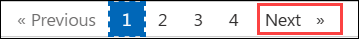

# Challenge 1: Build the dashboard

### Estimated Duration: 120 Minutes

## Overview

In this exercise, you will build a complete Power BI Sales Performance dashboard using a sample sales dataset. You will import and model data, create DAX measures, and design interactive report visuals. You will also apply themes and formatting to produce a professional, board-ready dashboard. Finally, you will validate the report to ensure it is accurate, interactive, and ready for business analysis.

## Objectives

In this exercise you will:

- Task 1: Review the brief and explore the dataset
- Task 2: Model the data
- Task 3: Create 3 KPIs
- Task 4: Create 2 charts and 1 slicer
- Task 5: Apply a theme

## Task 1: Review the brief and explore the dataset

1. Open **File Explorer** and navigate to **C:\LabFiles\data**.

2. Verify that the folder contains the following CSV files:
   - **Dim_Customer.csv**
   - **Dim_Date.csv**
   - **Dim_Product.csv**
   - **Dim_Region.csv**
   - **Dim_SalesRep.csv**
   - **Fact_Budget.csv**
   - **Fact_Sales.csv**

3. Open any one of the CSV files (for example, **Dim_Customer.csv**) in **Visual Studio Code** and verify that it contains sample data.

## Task 2: Model the Data

1. Open **Power BI Desktop** and create a **Blank report**.

2. Import all CSV files from **C:\LabFiles\data** using **Get data > Text/CSV**, and load them into the report.

3. In **Model** view, create the required relationships between the fact and dimension tables.

4. Mark the **Dim_Date** table as the **Date table** using the **Date** column.

5. Create a date hierarchy in the **Dim_Date** table using the **Year**, **Quarter**, **MonthName**, and **YearMonth** columns.

6. Hide the technical columns in the **Fact_Sales** table:
   - **OrderID**
   - **RegionID**
   - **SalesRepID**

7. Create a simple table visual using **RegionID** from **Dim_Region** and **Revenue** from **Fact_Sales** to verify that the relationships are working correctly.

## Task 3: Create KPIs

1. Create a new table named **_Measures** to store all DAX measures.

2. Create a **Total Revenue** measure using DAX and format it as **Currency**.

3. Create a **Gross Margin %** measure using DAX.

4. Format the **Gross Margin %** measure as **Percentage** with one decimal place.

5. Create a **Target Attainment %** measure using DAX.

6. Format the **Target Attainment %** measure as **Percentage** with one decimal place.

7. Add three **Card** visuals to the report and display the **Total Revenue**, **Gross Margin %**, and **Target Attainment %** measures.

8. Update the card titles to **Revenue**, **Gross Margin %**, and **Target Attainment**.

## Task 4: Create Charts and a Slicer

1. Create a **Line chart** using **MonthName** from **Dim_Date** and **Total Revenue** from the **_Measures** table.

2. Create a **Clustered bar chart** using **Country** from **Dim_Region** and **Total Revenue** from the **_Measures** table.

3. Sort the clustered bar chart by **Total Revenue** in **descending** order.

4. Add a **Slicer** using the **Country** field from **Dim_Region**.

5. Change the slicer style to **Dropdown**.

6. Select **India** from the slicer and verify that all report visuals are filtered accordingly.

7. Rename the line chart title to **Revenue Trend (Last 18 Months)**.

8. Rename the bar chart title to **Revenue by Region**.

## Task 5: Apply a Theme

1. Apply a **Dark** theme to the report from the **View** tab.

2. Customize the current theme by changing **Color 1** to a light green shade.

3. Insert a **Text box** and add the title **Sales Performance – Board View**.

4. Set the title font size to **24**.

5. Arrange the KPI cards, charts, and slicer into a clean dashboard layout with the title positioned at the top.

6. Review the dashboard to ensure the theme, formatting, and layout are consistent.

## Summary

In this lab, you:

- Verified the sales dataset and imported the required CSV files into Power BI.
- Built a star schema data model with relationships, a date table, and hierarchies.
- Created DAX measures and KPI cards to analyze revenue, gross margin, and target attainment.
- Designed interactive report visuals, including charts and slicers, for sales analysis.
- Applied a custom theme and formatting to produce a professional, board-ready dashboard.

## Click **Next >>** to continue to the next lab.

