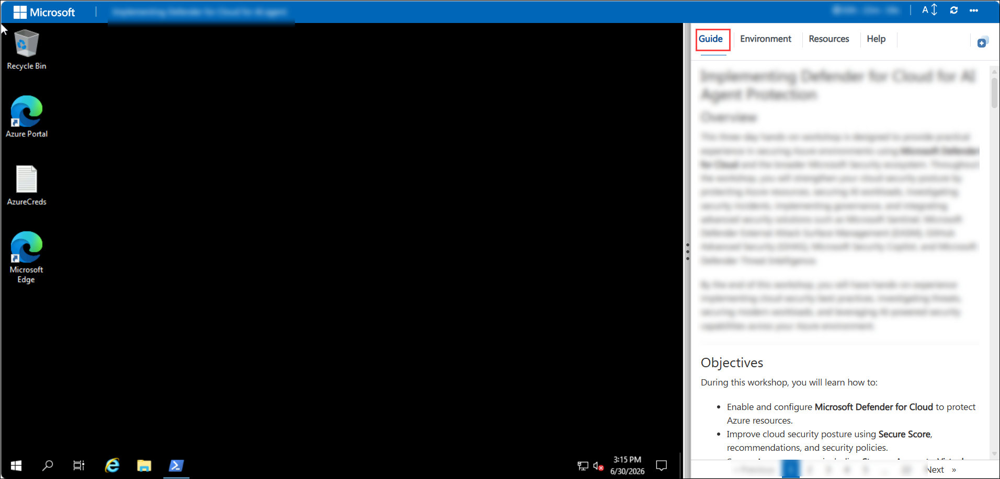
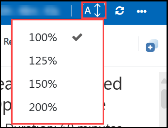
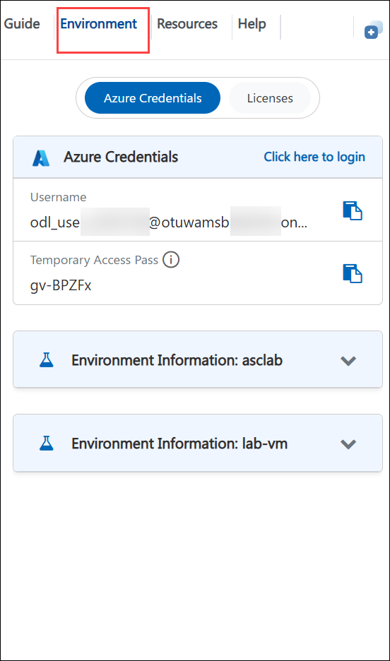
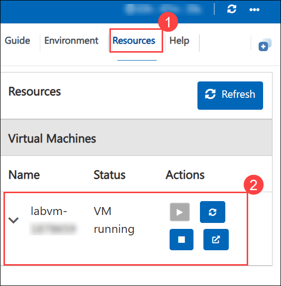
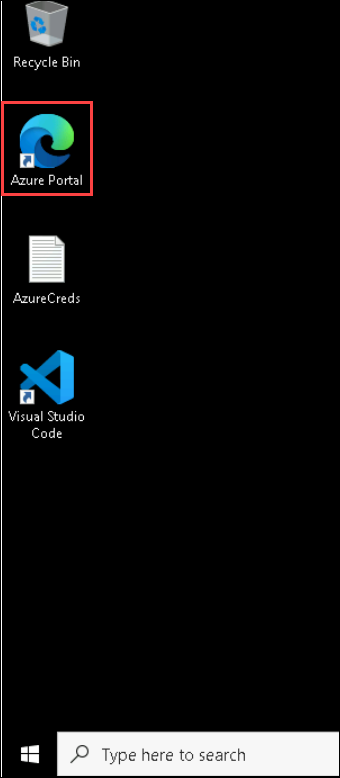
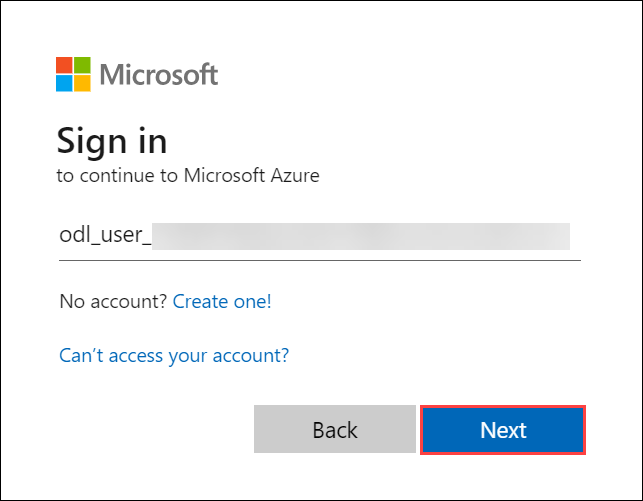

# Board-Ready Dashboard Challenge (L300: Advanced - Unguided)

### Estimated Duration: 4 Hours

## Overview
 
This unguided challenge tests what you have learned. With a fresh dataset and no step-by-step instructions, you will model the data and build a board-ready dashboard against a brief, attempt stretch goals such as Row-Level Security and Copilot and submit your work for evaluation against a rubric.

## Objectives

By the end of this lab, participants will be able to:

- Implement Row-Level Security (RLS) to restrict report access based on user roles.

- Use Power BI Copilot to generate an AI-powered narrative for business insights.

- Enhance the report by adding and formatting a custom visual.

- Publish the completed dashboard to a Microsoft Fabric workspace.

- Export the report for sharing and validate it against a business evaluation checklist to ensure it is secure, accurate, and presentation-ready.

## Pre-requisites

Participants should have:

- A completed Sales Performance Power BI report.
Power BI Desktop installed.

- A lab-provided Power BI account with access to Copilot.

- Access to a Microsoft Fabric workspace with permission to publish reports.

- An active internet connection to access Power BI Service, Copilot, and AppSource.
   

## Getting Started with Lab
Once you're ready to dive in, your virtual machine and **Guide** will be right at your fingertips within your web browser.

## Lab Guide Zoom In/Zoom Out

To adjust the zoom level for the environment page, click the **A↕ : 100%** icon located next to the timer in the lab environment.

## Virtual Machine & Lab Guide
Your virtual machine is your workhorse throughout the workshop. The guide is your roadmap to success.

## Exploring Your Lab Resources
To get a better understanding of your lab resources and credentials, navigate to the **Environment** tab.

## Utilizing the Split Window Feature
For convenience, you can open the lab guide in a separate window by selecting the **Split Window** button from the top right corner.

## Managing Your Virtual Machine
Feel free to **start, restart, or stop (2)** your virtual machine as needed from the **Resources (1)** tab. Your experience is in your hands!

## Let's Get Started with Azure Portal
 
1. On your virtual machine, click on the **Azure Portal** icon.

    

1. On the **Sign in to Microsoft Azure** tab, you will see the login screen. Enter the following email/username, and click on **Next (2)**. 

   * **Email/Username**: <inject key="AzureAdUserEmail"></inject> **(1)**
   
       
     
1. Now enter the following Temparory Access Pass and click on **Sign in (2)**.
   
   * **Temporaray Access Pass**: <inject key="AzureAdUserPassword"></inject> **(1)**

      
     
1. If you see the pop-up **Stay Signed in?**, select **No**.

   

1. If you see the pop-up **You have free Azure Advisor recommendations!**, close the window to continue the lab.

1. If a **Welcome to Microsoft Azure** popup window appears, select **Maybe Later** to skip the tour.

## Support Contact

The CloudLabs support team is available 24/7, 365 days a year, via email and live chat to ensure seamless assistance at any time. We offer dedicated support channels tailored specifically for both learners and instructors, ensuring that all your needs are promptly and efficiently addressed.

Learner Support Contacts:

- Email Support: cloudlabs-support@spektrasystems.com
- Live Chat Support: https://cloudlabs.ai/labs-support

Click **Next >>** from the bottom right corner to embark on your Lab journey!

### Happy Learning!!
