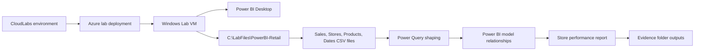

# Getting Started: Build Your First Store Performance Report in Power BI Desktop

## Scenario

You are a new business analyst for a fictional retail chain. Your manager has provided four CSV files that describe sales transactions, store details, product information, and dates. In this lab, you will use Power BI Desktop on a Windows Lab VM to load the CSV files, shape the data, create a simple model, build a one-page store performance dashboard, and write your first beginner DAX measures.

The finished report will help answer common retail questions, such as which stores sell the most, how sales trend over time, which product categories perform best, and how slicers or drill-down interactions change the view of the data.

## Lab VM and sign-in context

This lab runs on a dedicated Windows Lab VM that is provisioned for you. The deployment creates the VM, installs or verifies Power BI Desktop, and places the required local lab assets in a known folder before you begin.

1. If your CloudLabs environment provides a **Launch VM** or **Connect** button, use it to open the Windows Lab VM session.
2. If you need to sign in to the Azure portal during the lab, browse to <https://portal.azure.com> and use the following credentials:
   - Username: `<inject key="AzureAdUserEmail"></inject>`
   - Password: `<inject key="AzureAdUserPassword"></inject>`
3. Your Azure subscription for this lab is `<inject key="SubscriptionID"></inject>` and your tenant is `<inject key="TenantID"></inject>`.
4. Your lab deployment identifier is part of the resource name **PowerBI-Retail-<inject key="DeploymentID" enableCopy="false"/>**. You may see this identifier in CloudLabs or Azure resource names if you inspect the deployment.

> [!Important]
> The Power BI work in this lab is completed locally in Power BI Desktop. You do not need to publish to the Power BI service, create Azure data services, or use Power BI administrator permissions.

## Lab overview

You will work with the following local folder on the Windows Lab VM:

```text
C:\LabFiles\PowerBI-Retail
```

The folder contains the retail source data files:

```text
C:\LabFiles\PowerBI-Retail\Sales.csv
C:\LabFiles\PowerBI-Retail\Stores.csv
C:\LabFiles\PowerBI-Retail\Products.csv
C:\LabFiles\PowerBI-Retail\Dates.csv
```

It also contains an evidence folder used for saved report files and validation outputs:

```text
C:\LabFiles\PowerBI-Retail\Evidence
```

By the end of the lab, you should have these learner-created files in the evidence folder:

```text
C:\LabFiles\PowerBI-Retail\Evidence\StorePerformanceReport.pbix
C:\LabFiles\PowerBI-Retail\Evidence\DAXMeasures.txt
C:\LabFiles\PowerBI-Retail\Evidence\StorePerformanceReport.png
```

A PDF or JPG export is also acceptable for the final report evidence if your environment uses one of those formats:

```text
C:\LabFiles\PowerBI-Retail\Evidence\StorePerformanceReport.pdf
C:\LabFiles\PowerBI-Retail\Evidence\StorePerformanceReport.jpg
```

## Objectives

After completing this lab, you will be able to:

- Launch Power BI Desktop on a prepared Windows Lab VM.
- Connect Power BI Desktop to local CSV files by using **Get data** > **Text/CSV**.
- Use Power Query Editor to review, clean, rename, type, and shape source columns.
- Load shaped queries into the Power BI Desktop model.
- Create or verify relationships between a sales fact table and store, product, and date tables.
- Build a single-page store performance report with cards, charts, slicers, filters, and basic interactions.
- Create simple DAX measures such as `Total Sales`, `Total Units`, and `% of Total Sales`.
- Save the PBIX file, DAX measure definitions, and report screenshot or export in the required evidence folder.

## Prerequisites

You should be comfortable with basic Windows tasks such as opening File Explorer, launching desktop applications, browsing folders, and saving files. No previous Power BI experience is required.

Optional Power BI service sign-in may be available if your organization provides it, but the core lab does not require publishing. If Power BI Desktop asks you to sign in and you do not have a Power BI service account for this lab, close or skip the prompt when the UI allows it and continue working in Power BI Desktop.

## Architecture

The lab uses a simple local-file architecture. Azure provides the disposable Windows Lab VM. Power BI Desktop and the CSV source files are prepared on the VM, and all learner-created evidence is saved locally.



### Component details

| Component | Purpose |
|---|---|
| Windows Lab VM | Your isolated workstation for the lab. |
| Power BI Desktop | The desktop authoring tool used to connect to data, transform data, model relationships, create visuals, and save the `.pbix` report. |
| `C:\LabFiles\PowerBI-Retail` | The working folder containing all source CSV files. |
| `Sales.csv` | Transaction-level or sales-grain data used as the main fact table. |
| `Stores.csv` | Store lookup data, such as store name, region, and optional location fields. |
| `Products.csv` | Product lookup data, such as product name and product category. |
| `Dates.csv` | Date lookup data used for date filtering, trends, and drill-down. |
| `Evidence` folder | The required output folder for the completed PBIX, DAX text file, and screenshot/export evidence. |

## Power BI Desktop workflow reference

Power BI Desktop includes three primary views that you will use throughout the lab:

- **Report view**: build and arrange report pages and visualizations.
- **Table view**: inspect loaded data, create measures, and review table fields.
- **Model view**: view and manage relationships between tables.

Power BI Desktop also includes Power Query Editor. You open it from the **Home** tab by selecting **Transform data**. Power Query Editor is where you connect to sources, shape data, change data types, rename columns, remove rows, and apply other transformations before loading the data into the model.

For local CSV files, the relevant workflow is:

1. In Power BI Desktop, select **Home** > **Get data** > **Text/CSV**.
2. Browse to a CSV file in `C:\LabFiles\PowerBI-Retail`.
3. Select **Open**.
4. In the preview or Navigator window, select **Transform Data** when you need to shape the data before loading.
5. In Power Query Editor, apply the required transformations.
6. Select **Close & Apply** to load the shaped query into Power BI Desktop.
7. Save your work with **File** > **Save** or **File** > **Save As** when you are ready to create the PBIX evidence file.

> [!Tip]
> Power Query transformations do not edit the original CSV files. Power Query records transformation steps and applies those steps when data is loaded or refreshed.

## Launch Power BI Desktop

Use one of the following methods to open Power BI Desktop on the Lab VM:

1. Double-click the **Power BI Desktop** shortcut on the desktop, if present.
2. Or, open the Windows **Start** menu, type `Power BI Desktop`, and select **Power BI Desktop** from the results.
3. If Power BI Desktop displays a welcome screen, close it or select an option that starts a blank report.
4. If prompted to sign in to Power BI, sign in only if your organization has provided Power BI service access. Otherwise, skip or close the prompt and continue in Power BI Desktop.
5. Confirm you can see the main Power BI Desktop canvas with the left-side view icons for report, table, and model work.


## Evidence folder expectations

Automated validations later in the lab look for specific evidence files. Save files exactly as described so the checks can find them.

| Evidence file | Required name or accepted format | Created in |
|---|---|---|
| Final PBIX report | `StorePerformanceReport.pbix` | Exercise 3 |
| DAX measure definitions | `DAXMeasures.txt` | Exercise 3 |
| Report image or export | `StorePerformanceReport.png`, `StorePerformanceReport.jpg`, or `StorePerformanceReport.pdf` | Exercise 3 |

Use this exact folder for all evidence files:

```text
C:\LabFiles\PowerBI-Retail\Evidence
```

> [!Important]
> Do not save the final PBIX or DAX text file only to Desktop, Downloads, or Documents. Copy or save the final versions into `C:\LabFiles\PowerBI-Retail\Evidence` before running validations.

## How the exercises fit together

This lab is divided into three connected exercises. Each exercise builds on the work from the previous one.

### Exercise 1: Get started and prepare your retail data

You will open Power BI Desktop, connect to the four CSV files, use Power Query Editor to clean and shape the data, set appropriate data types, load the data, and create or verify relationships between tables.

Expected result: the Power BI model contains usable `Sales`, `Stores`, `Products`, and `Dates` tables with working relationships.

### Exercise 2: Build your store performance report

You will create a one-page store performance dashboard. The page will include KPI cards, charts, a table or matrix, slicers, cross-filtering behavior, and beginner-friendly formatting.

Expected result: the report page helps compare store sales, unit sales, product categories, date trends, and regions.

### Exercise 3: Add your first DAX measures and finalize

You will create DAX measures such as `Total Sales`, `Total Units`, and `% of Total Sales`, use those measures in visuals, save the final PBIX file, export a report screenshot or PDF/image, and copy your DAX definitions into `DAXMeasures.txt`.

Expected result: the evidence folder contains the completed PBIX, DAX measure text file, and report image or export used by validations.

## Recommended working habits

- Save your PBIX file frequently while you work.
- Keep the CSV source files in `C:\LabFiles\PowerBI-Retail`; moving them may break refresh paths.
- Use clear table and measure names so your report is easy to review.
- After major changes in Power Query Editor, select **Close & Apply** so the model receives the updates.
- Before finishing the lab, open the Evidence folder and verify all required files are present and non-empty.

## After publishing

> [!Note] These steps run **after** you push the template to CloudLabs — they verify CloudLabs can actually serve this lab guide to candidates.

- **Verify docs-proxy access:** open Templates → your template → **Lab Guide Settings** in <https://admin.cloudlabs.ai> and confirm CloudLabs can reach this repo via the docs proxy. If the repo is private, configure GitHub access at the template level.
- **Verify inline questions and inline validations:** sign in to <https://admin.cloudlabs.ai>, open your template, and walk through one full lab run to confirm every `<question>` and `<validation step="..."/>` renders correctly. Fix any that don't resolve.
