# Exercise 01: Get started and prepare your data

### Estimated Duration: 90 minutes

## Scenario

You are a new business analyst at Contoso Retail. Your manager has pointed you at four CSV files hosted in Azure Blob Storage that hold the company's sales, store, product, and calendar data. In this exercise, you will get Power BI Desktop ready, connect to those CSVs over HTTPS, run your first refresh, and shape the data so it is ready for reporting.

## Overview

In this exercise you will:

- Sign in to the Power BI service and confirm Power BI Desktop is installed on the lab VM.
- Tour the Power BI Desktop workspace and identify the areas you will use later.
- Locate the four Contoso Retail CSV URLs and understand what each file contains.
- Connect Power BI Desktop to those CSVs using the **Web** connector and run the first data refresh.
- Clean and shape the imported data in Power Query so the columns are named, typed, and ready to model.

## Objectives

- Task 1: Sign in to the Power BI service and confirm Power BI Desktop is installed
- Task 2: Tour the Power BI Desktop environment
- Task 3: Locate the sample retail dataset
- Task 4: Connect to the CSVs and run a first refresh
- Task 5: Clean and shape the data in Power Query

## Task 1: Sign in to the Power BI service and confirm Power BI Desktop is installed

In this task, you will sign in to the Power BI service in a browser and confirm Power BI Desktop is installed on the lab VM.

1. On the lab VM, open **Power BI**.

1. On the top right corner. Click on sign in.
   
   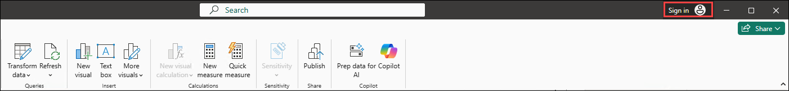

1. Enter your **Email:** <inject key="AzureAdUserEmail"></inject>. Then click **Continue**.

   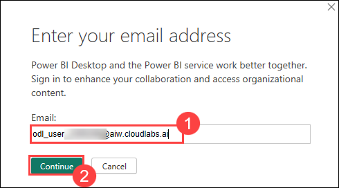

2. Sign in with the CloudLabs credentials:

   - Username: <inject key="AzureAdUserEmail"></inject>
   - Password: <inject key="AzureAdUserPassword"></inject>

   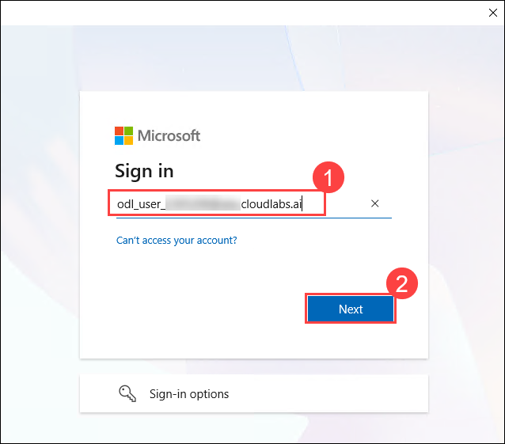

   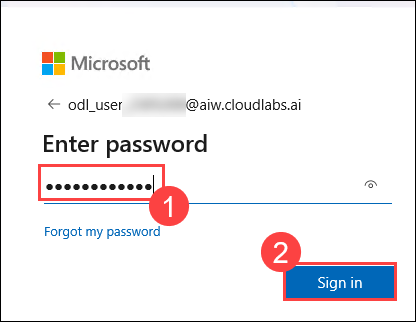

3. If you see a **Sign in to all apps?** prompt, choose **Yes** so you do not need to sign in repeatedly during the lab.

   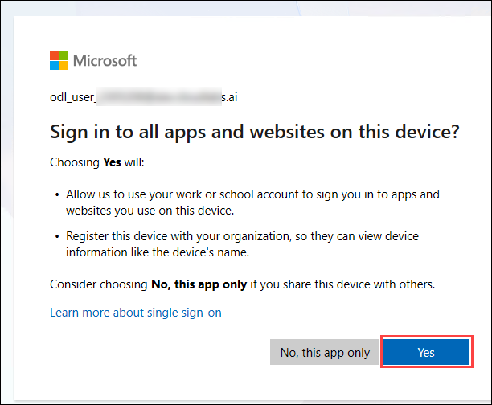

1. Click **Ok** when Power BI free license is assigned

   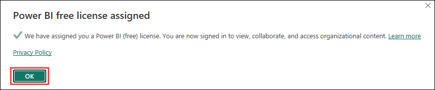

## Task 2: Tour the Power BI Desktop environment

In this task, you will identify the areas of Power BI Desktop you will use throughout the lab.

1. On the left side of the window, locate the three view icons:

   - **Report view (1)** — build report pages and visuals.
   - **Table view (2)** — inspect loaded table data and create measures.
   - **Model view (3)** — view and manage relationships between tables.

   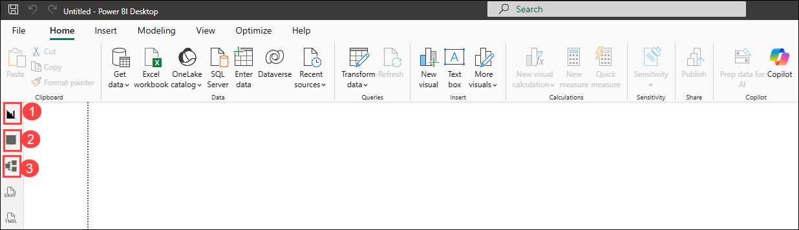

2. Select **Report view**. This is where you will build the Store Performance report in Exercise 2.

   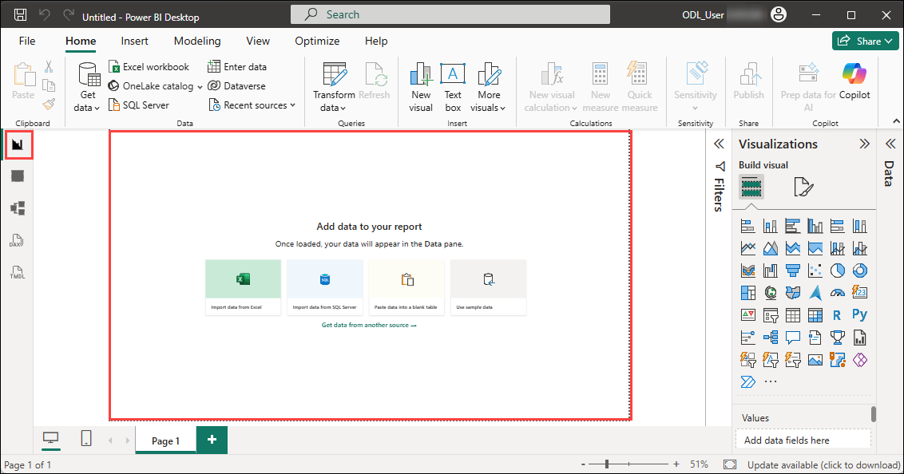

3. Select **Table view**. Data tables will appear here once you load them.

   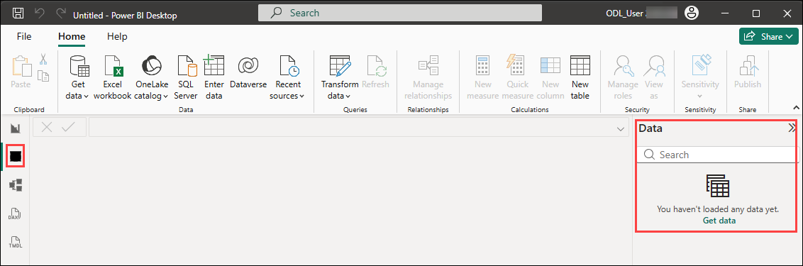

4. Select **Model view**. Relationship diagrams will appear here once the tables are loaded.

   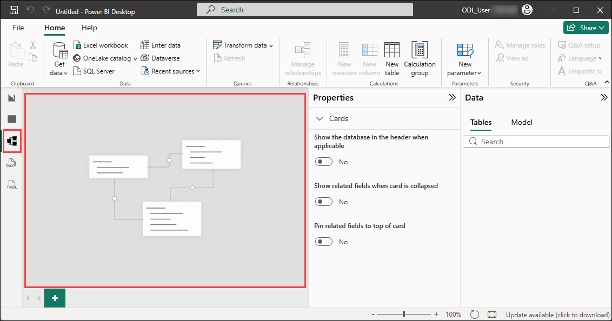

5. Return to **Report view**.

   

6. On the right side of Power BI Desktop, identify these panes:

   - **Data** (or **Fields**) — lists loaded tables and columns.
   - **Visualizations** — lets you pick chart types and configure fields.
   - **Filters** — lets you filter a visual, a page, or the whole report.

   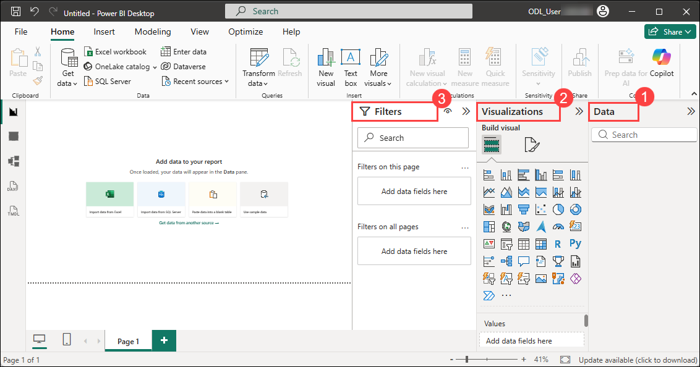

7. On the **Home** ribbon, locate these buttons — you will use each of them in this lab:

   - **Get data (1)** — connect to sources.
   - **Transform data (2)** — open Power Query Editor.
   - **Refresh (3)** — rerun the queries against the source.
   - **New measure (4)** — create DAX measures (Exercise 3).
   - **Publish (5)** — send to the Power BI service.

   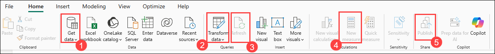

## Task 3: Locate the sample retail dataset

In this task, you will note the URLs for the Contoso Retail CSV files. You will use these URLs in Task 4.

1. The four CSVs are hosted in an Azure Blob Storage container with anonymous read access. Use these exact URLs when the lab asks you to connect:

   | File | URL |
   |---|---|
   | Stores | `https://experienceazure.blob.core.windows.net/templates/powerbi-training/Assets/Stores.csv` |
   | Products | `https://experienceazure.blob.core.windows.net/templates/powerbi-training/Assets/Products.csv` |
   | Dates | `https://experienceazure.blob.core.windows.net/templates/powerbi-training/Assets/Dates.csv` |
   | Sales | `https://experienceazure.blob.core.windows.net/templates/powerbi-training/Assets/Sales.csv` |

2. Review what each CSV contains:

   | File | Role | Key columns |
   |---|---|---|
   | `Stores.csv` | Store dimension | `StoreID`, `StoreName`, `Region`, `City`, `State`, `Country`, `Latitude`, `Longitude`, `StoreType`, `OpenDate` |
   | `Products.csv` | Product dimension | `ProductID`, `ProductName`, `Category`, `Subcategory`, `Brand`, `UnitPrice` |
   | `Dates.csv` | Calendar dimension | `Date`, `Year`, `Quarter`, `MonthNumber`, `MonthName`, `MonthYear`, `Weekday`, `IsWeekend` |
   | `Sales.csv` | Sales fact | `SalesID`, `Date`, `StoreID`, `ProductID`, `Quantity`, `UnitPrice`, `DiscountPct`, `Channel`, `TransactionType`, `CustomerSegment` |

3. Confirm the expected star-schema pattern:

   - `Sales.StoreID` refers to `Stores.StoreID`.
   - `Sales.ProductID` refers to `Products.ProductID`.
   - `Sales.Date` refers to `Dates.Date`.

   > **Note:** You will verify these relationships after loading the data in Task 5.

4. Optional check — open one URL in your browser to confirm you can reach the file:

   - Paste the `Stores.csv` URL into a new browser tab.
   - The browser downloads or displays the CSV. If you see a **403** or **404** error, notify your instructor before continuing.

   

## Task 4: Connect to the CSVs and run a first refresh

In this task, you will use the **Web** connector in Power BI Desktop to connect to the four Contoso Retail CSVs, import them, and run the first refresh.

### Connect to the first CSV

1. In Power BI Desktop, on the **Home** ribbon, select **Get data** > **Web**.

   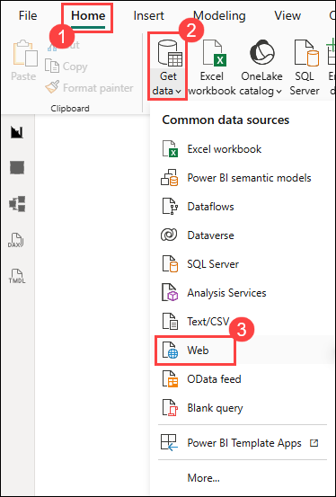

2. In the **From Web** dialog, leave the mode on **Basic (1)** and paste the `Sales.csv` (2) URL. Select **OK (3)**.

   ```
   https://experienceazure.blob.core.windows.net/templates/powerbi-training/Assets/Sales.csv
   ```

   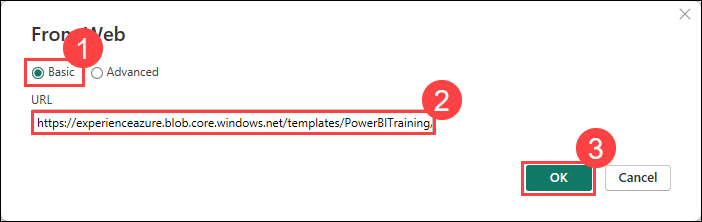

4. If Power BI prompts you to configure the credentials for the URL:

   - On the left side of the credentials dialog, select **Anonymous**.
   - Leave **Select which level to apply these settings to** at the default.
   - Select **Connect**.

   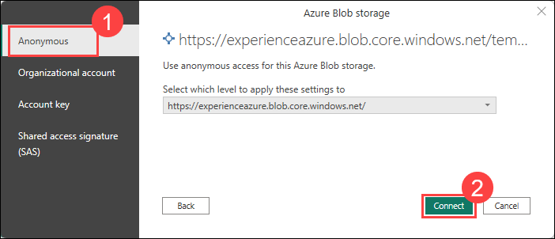

   > **Note:**  The CSVs are hosted with anonymous public read. Do not choose **Basic**, **Windows**, or **Organizational account** here — those will fail because the source has no such credentials configured.

5. In the preview window, review the detected delimiter, column headers, and sample rows.

6. Select **Transform Data** (not **Load**). Power Query Editor opens with a single query named `Sales`.

   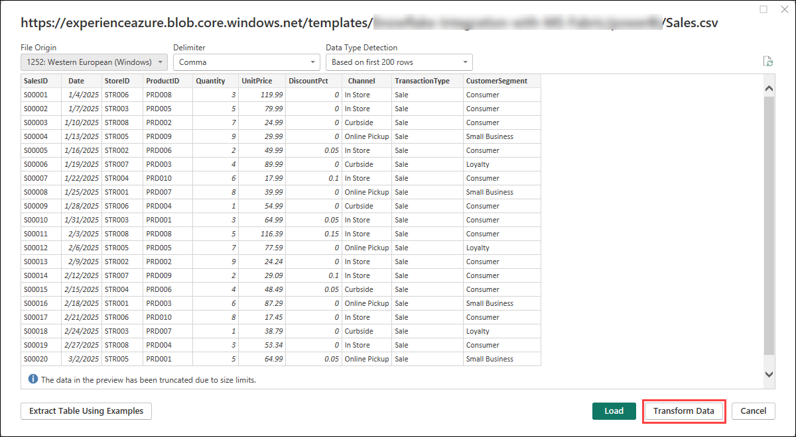

### Add the remaining three CSVs

1. In Power Query Editor, on the **Home** ribbon, select **New Source** > **Web**.

   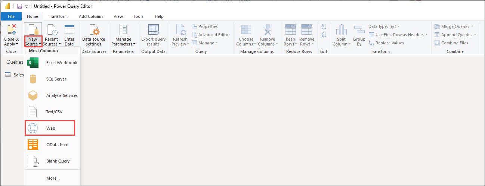

2. Paste the `Stores.csv` URL: https://experienceazure.blob.core.windows.net/templates/powerbi-training/Assets/Stores.csv, select **OK**, and if prompted keep **Anonymous** authentication.

   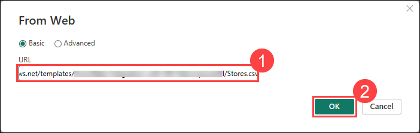

3. When the preview appears, select **OK** to add the query. Power Query names it `Stores`.

   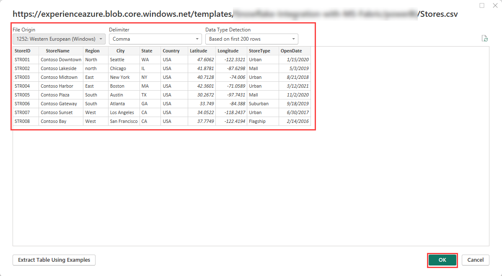

4. Repeat for the remaining two files:

   - `Products.csv` : https://experienceazure.blob.core.windows.net/templates/powerbi-training/Assets/Products.csv

   - `Dates.csv` : https://experienceazure.blob.core.windows.net/templates/powerbi-training/Assets/Dates.csv

   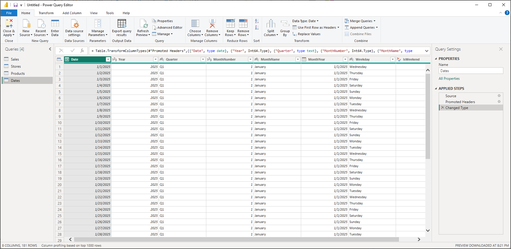

5. In the left **Queries** pane, confirm you now have four queries: `Sales`, `Stores`, `Products`, `Dates`.

   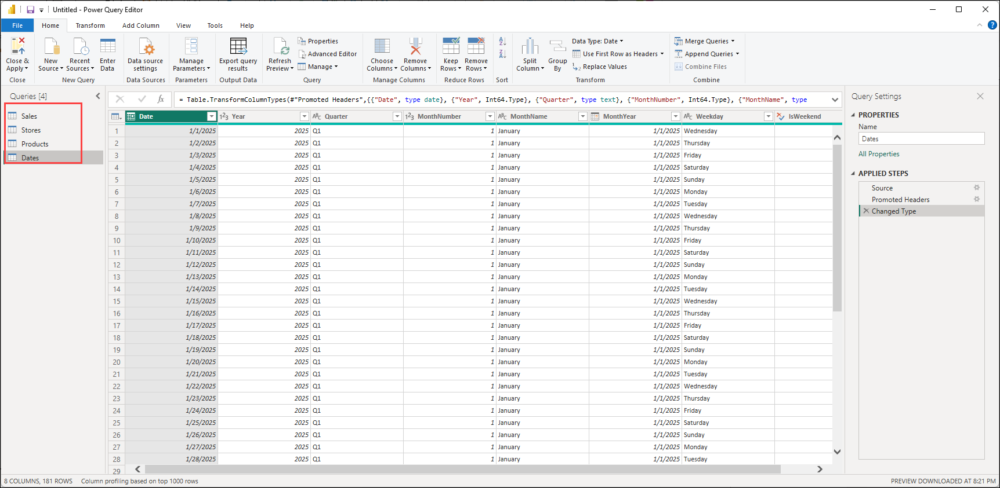

6. If any query name includes the file extension (for example `Sales.csv`), right-click the query name, select **Rename**, and rename it to the clean table name (`Sales`).

   > **Note:** Clean table names make DAX formulas and report fields easier to read later.

### Run the first refresh

1. On the **Home** ribbon in Power Query Editor, select **Refresh Preview** > **Refresh All**.

   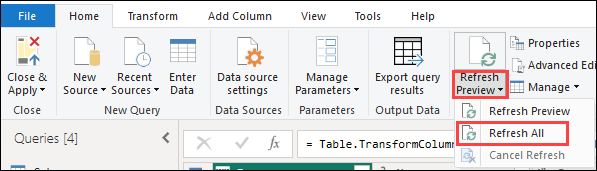

2. Each query re-reads its CSV from Azure Blob Storage. You have now run your first refresh.

   > **Note:** **Refresh Preview** in Power Query only refreshes the sample used in the editor. The full refresh of the model runs when you choose **Close & Apply** or use **Refresh** in Power BI Desktop.

## Task 5: Clean and shape the data in Power Query

In this task, you will apply beginner-friendly Power Query steps to prepare the data for reporting. Power Query records each step under **Applied Steps** so you can review or remove them later.

### Shape the Sales query

1. In the left **Queries** pane, select `Sales`.

   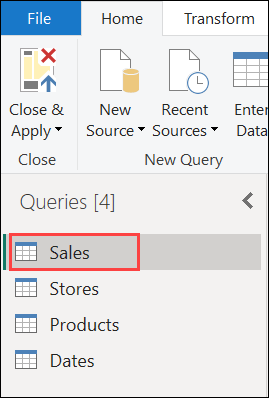

2. Confirm the first row is used as column headers. 

   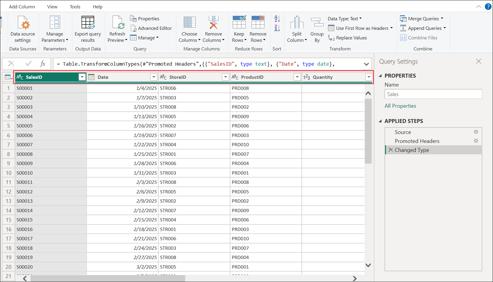

   > **Note:** If the headers appear as data values, select **Home** > **Use First Row as Headers**.

   > 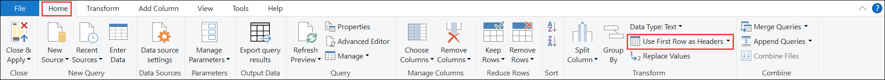

3. Confirm and correct data types by selecting the type icon to the left of each column name:

   | Column | Data type |
   |---|---|
   | `SalesID` | Text |
   | `Date` | Date |
   | `StoreID` | Text |
   | `ProductID` | Text |
   | `Quantity` | Whole Number |
   | `UnitPrice` | Decimal Number |
   | `DiscountPct` | Decimal Number |
   | `Channel` | Text |
   | `TransactionType` | Text |
   | `CustomerSegment` | Text |

   > 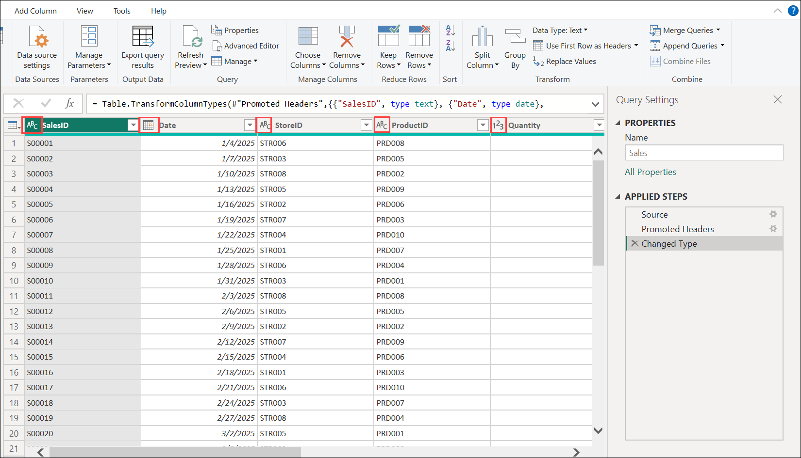

4. Remove blank rows and any conversion errors:

   - Select **Home** > **Remove Rows** > **Remove Blank Rows**.
   - Select the `Date` column, then **Home** > **Remove Rows** > **Remove Errors**. (This drops the intentional bad row that has `not-a-date` as its date value.)

   > 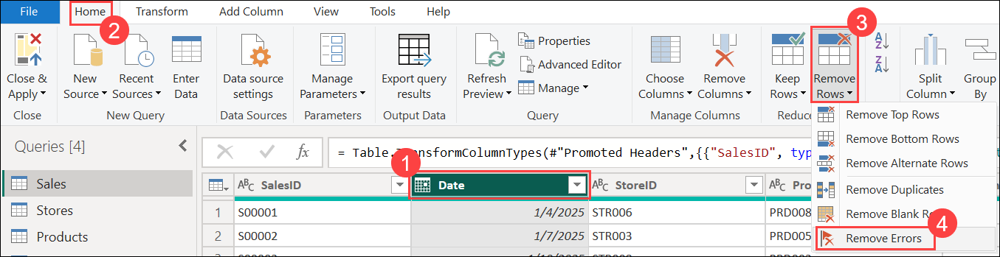

      > **Note:** `Sales.csv` includes one intentional blank row and one intentional bad row so you can practice these Power Query cleanup steps. After removal you should have exactly 240 clean sales rows.

5. Add a `SalesAmount` custom column that accounts for the discount:

   - Select **Add Column** > **Custom Column**.

      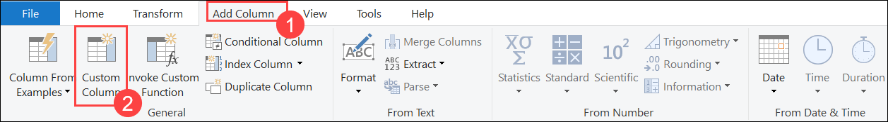

   - **New column name**: `SalesAmount`.
   - **Custom column formula**:

     ```powerquery
     [Quantity] * [UnitPrice] * (1 - [DiscountPct])
     ```
   - Select **OK**.

      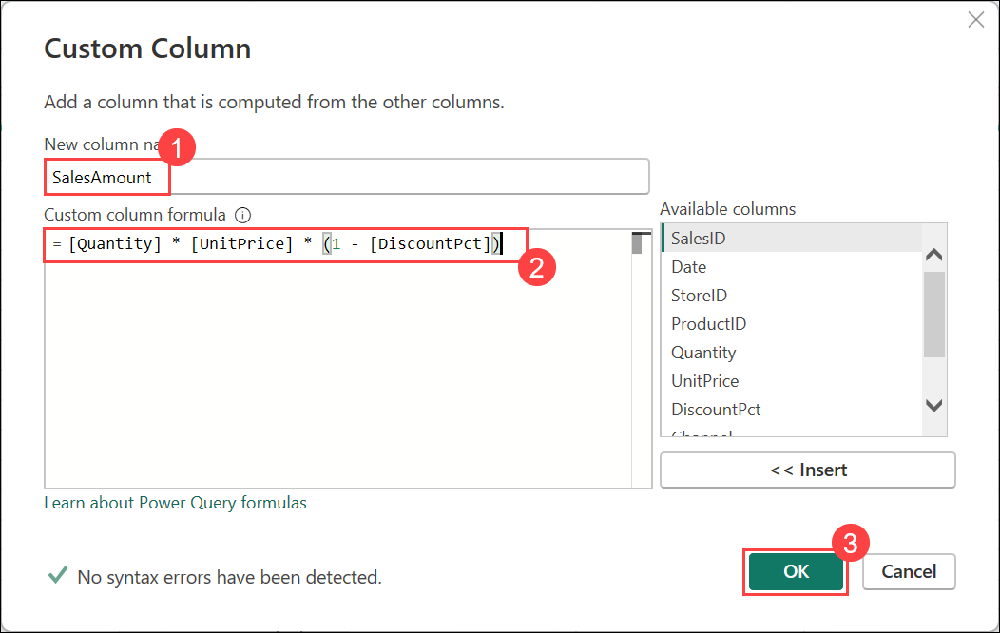

   - Change the type of the new `SalesAmount` column to **Fixed Decimal Number**.

      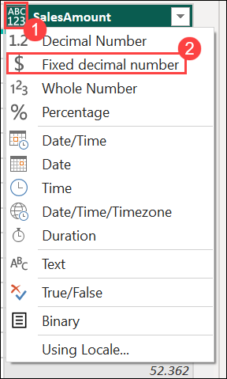

6. Review the **Applied Steps** pane. You should see steps such as **Source**, **Promoted Headers**, **Changed Type**, **Removed Blank Rows**, **Removed Errors**, and **Added Custom**.

      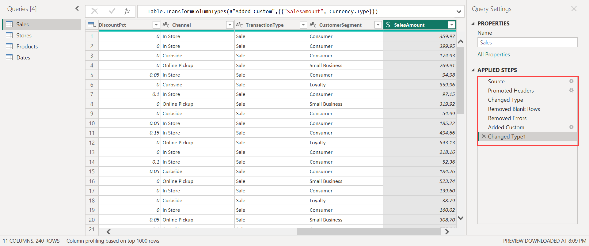

### Shape the Stores query

1. Select `Stores` in the **Queries** pane.

      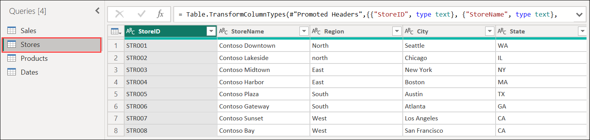

2. Confirm the first row is used as headers, then confirm data types:

   | Column | Data type |
   |---|---|
   | `StoreID` | Text |
   | `StoreName` | Text |
   | `Region` | Text |
   | `City` | Text |
   | `State` | Text |
   | `Country` | Text |
   | `Latitude` | Decimal Number |
   | `Longitude` | Decimal Number |
   | `StoreType` | Text |
   | `OpenDate` | Date |

3. The `Region` column contains inconsistent casing (for example, `North` and `north` for the same region). Standardize it:

   - Select the `Region` column.
   - Select **Transform** > **Format** > **Capitalize Each Word**.

      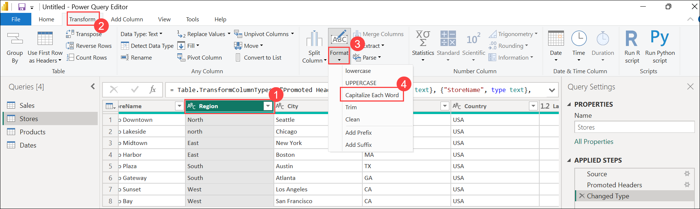

### Shape the Products query

1. Select `Products` in the **Queries** pane.

      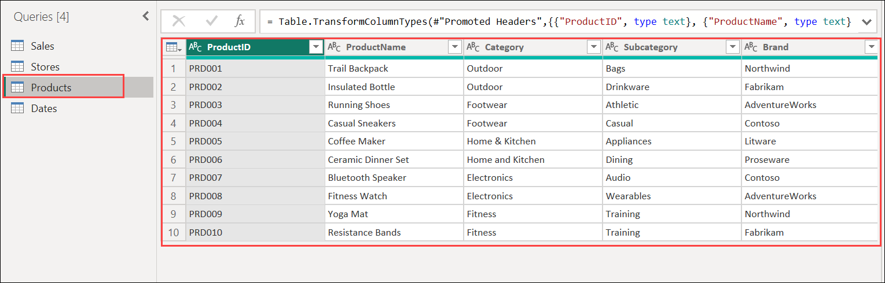

2. Confirm the first row is used as headers, then confirm data types:

   | Column | Data type |
   |---|---|
   | `ProductID` | Text |
   | `ProductName` | Text |
   | `Category` | Text |
   | `Subcategory` | Text |
   | `Brand` | Text |
   | `UnitPrice` | Fixed Decimal Number |

3. The `Category` column contains two spellings of the same category — `Home & Kitchen` and `Home and Kitchen`. Standardize them:

   - Select the `Category` column.
   - Select **Transform** > **Replace Values**.

      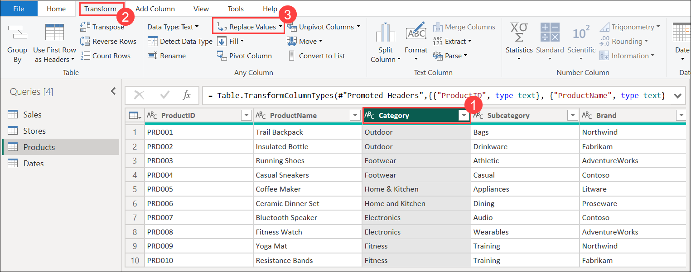

   - **Value to find**: `Home and Kitchen`
   - **Replace with**: `Home & Kitchen`
   - Select **OK**.

      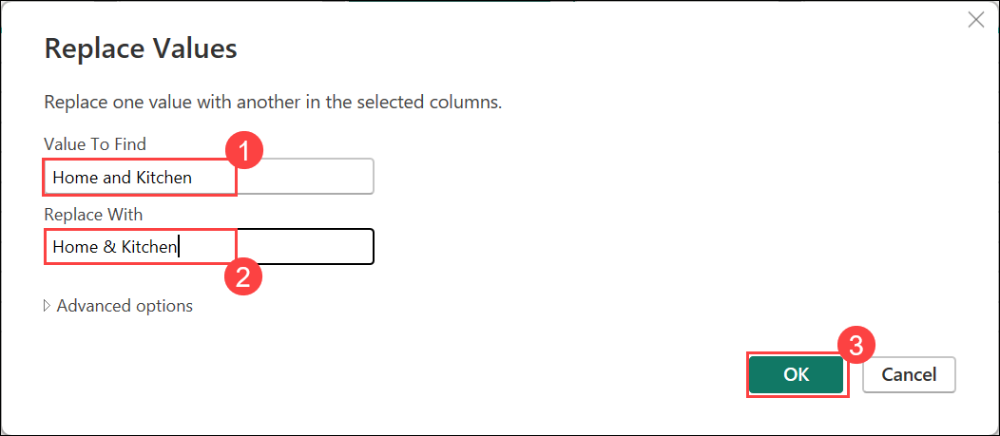

### Shape the Dates query

1. Select `Dates` in the **Queries** pane.

      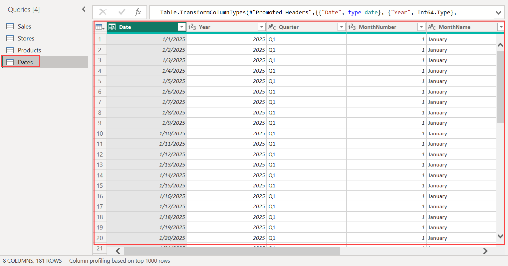

2. Confirm the first row is used as headers, then confirm data types:

   | Column | Data type |
   |---|---|
   | `Date` | Date |
   | `Year` | Whole Number |
   | `Quarter` | Text |
   | `MonthNumber` | Whole Number |
   | `MonthName` | Text |
   | `MonthYear` | Text |
   | `Weekday` | Text |
   | `IsWeekend` | True/False |

### Apply changes and verify relationships

1. On the **Home** ribbon, select **Close & Apply**.

   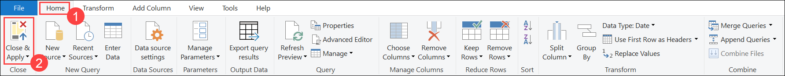

2. Wait for Power BI Desktop to load all four tables. You will see a progress dialog and then the report canvas.

3. Select **Model view** on the left.

   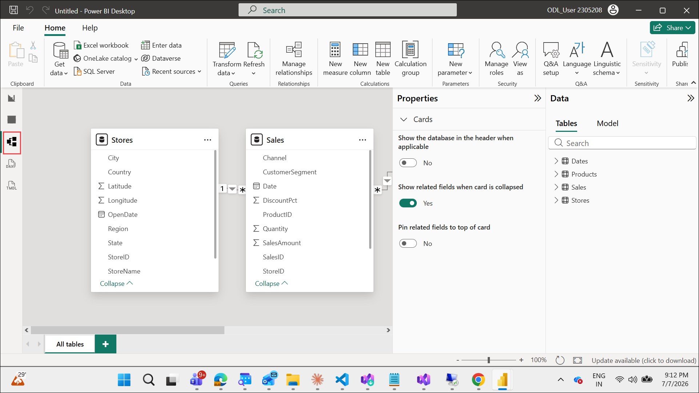

4. Confirm relationships were auto-detected. You should see lines connecting:

   | From | To | Cardinality |
   |---|---|---|
   | `Stores[StoreID]` | `Sales[StoreID]` | One-to-many (1:*) |
   | `Products[ProductID]` | `Sales[ProductID]` | One-to-many (1:*) |
   | `Dates[Date]` | `Sales[Date]` | One-to-many (1:*) |

5. If any relationship is missing, create it manually. On the ribbon, select **Home** > **Manage relationships**.

   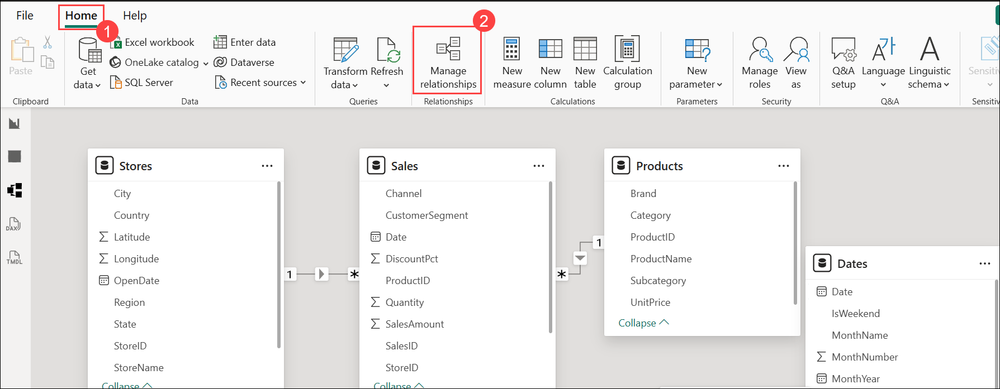

1. Select **New relationship**.

   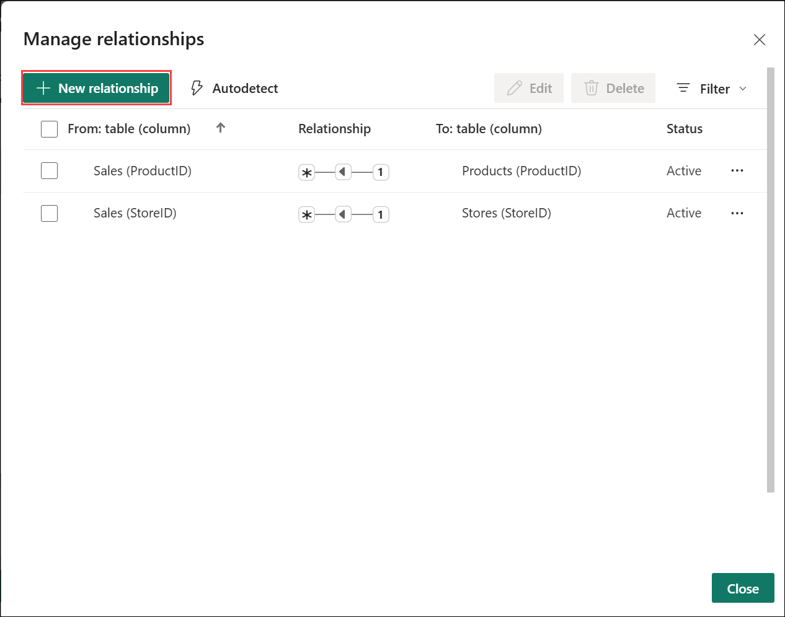

1. Set:

   - Choose the first table and column (for example `Dates` → `Date`).
   - Choose the second table and column (for example `Sales` → `Date`).
   - Confirm **Cardinality** is **One to many (1:*)** or **Many to one (*:1)**.
   - Set **Cross filter direction** to **Single**.
   - Confirm **Make this relationship active** is selected.
   - Select **Save**.

      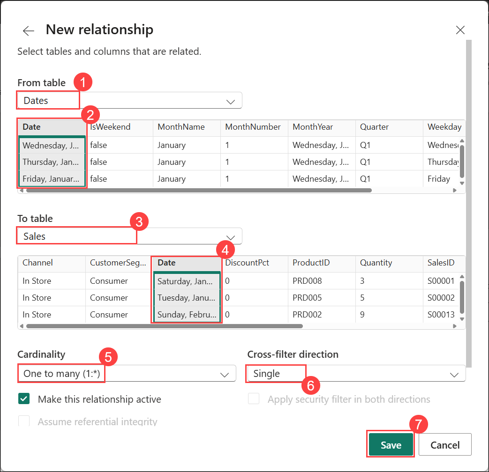

1 ENsure all three relationship is present. Repeat above steps for any other missing relationships. Select **Close**.

   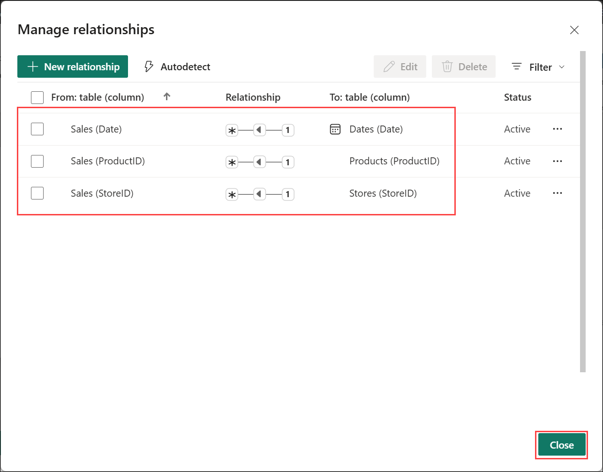

6. Drag the `Sales` table to the center of the Model view canvas and place `Stores`, `Products`, and `Dates` around it — this is the classic star schema layout and makes the model easier to read.

      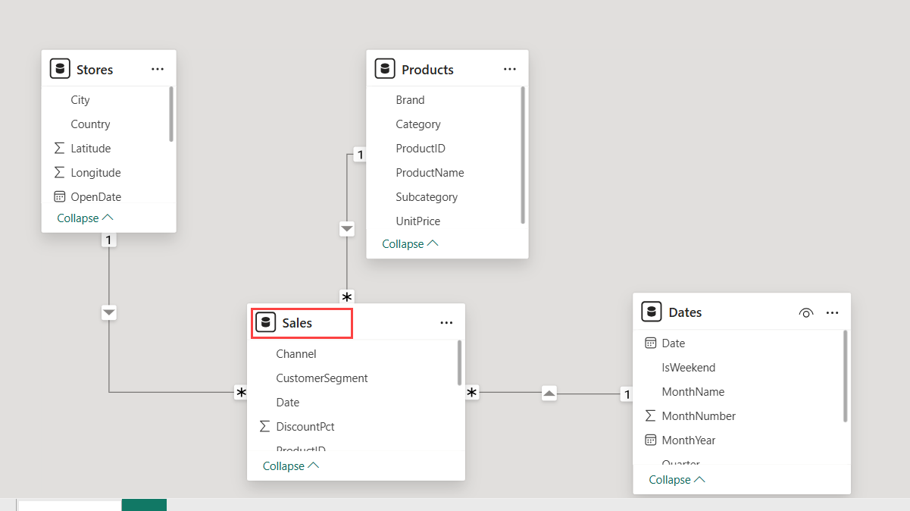

7. Select **Table view** fron left navigation and click each table briefly to confirm rows are loaded (you should see the sample data for each).

      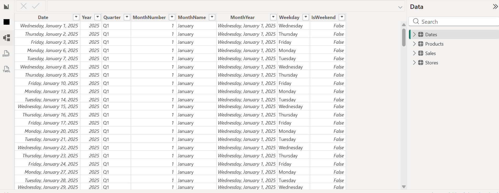

8. Return to **Report view**.

      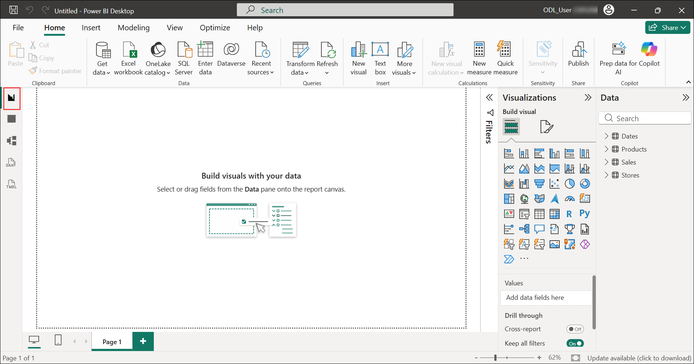

### Save your starter file

1. Select **File** > **Save As**.

1. Select Browse this device.

2. Navigate to `C:\LabFiles` path. The Add file name as StorePerformanceReport

   > [!Important]
   > Use this exact filename and folder. Later validations look for this file in the Evidence folder.

3. Keep Power BI Desktop open — you will build the report visuals in Exercise 2.

## Summary

In this exercise you signed in to the Power BI service, toured Power BI Desktop, connected to the four Contoso Retail CSV files hosted in Azure Blob Storage, ran your first refresh, and shaped the data in Power Query. Your model has clean, typed data and working relationships, and your starter `StorePerformanceReport.pbix` is saved in the Evidence folder — ready for report building in Exercise 2.
