# Exercise 02: Build your first report

### Estimated Duration: 90 minutes

## Scenario

Contoso Retail's leadership wants a single, clear report page that answers: which stores are performing best, how sales are trending over time, which product categories drive revenue, and how the view changes when you filter by date, region, or category. In this exercise, you will turn the model you built in Exercise 1 into an interactive **Store Performance** report.

## Overview

You will build one report page in Power BI Desktop using the model you loaded in Exercise 1. You will add core visuals (bar, line, card, table, map), KPI cards for the headline numbers, slicers and filters for interactivity, and configure drill-down and cross-filtering so viewers can explore the data.

## Objectives

- Task 1: Create core visuals — bar, line, card, table, and map
- Task 2: Add KPI cards for total sales, top store, and units sold
- Task 3: Add slicers and filters to slice-and-dice the data
- Task 4: Use drill-down and cross-filtering between visuals

## Task 1: Create core visuals

In this task, you will build one report page with five core visuals: a bar chart, a line chart, a card, a table, and a map.

### Open the report and prepare the page

1. On the lab VM, open Power BI Desktop and open your saved report:

   ```text
   C:\LabFiles\StorePerformanceReport.pbix
   ```

2. Confirm the following tables appear in the **Data** pane on the right: `Sales`, `Stores`, `Products`, `Dates`.

   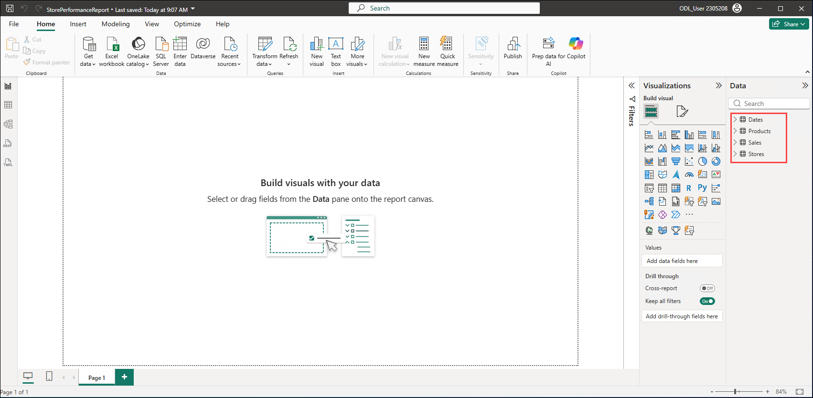

3. If the report has a blank page, use it. Otherwise select the **+** button at the bottom to add a new page.

4. Rename the page:

   - Right-click the page tab.
   - Select **Rename Page**.
   - Type `Store Performance`.
   - Press **Enter**. 

   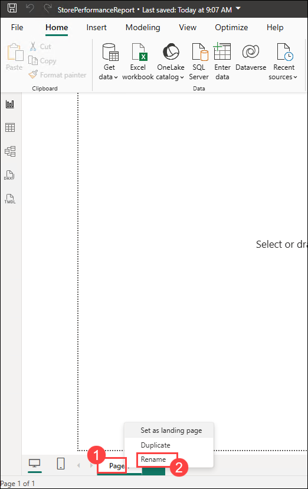

   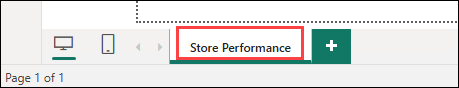

5. Set the page size to a standard 16:9 canvas:

   - With no visual selected, in the **Visualizations** pane, select **Format your page** (the paint-roller icon on the canvas card).
   - Expand **Canvas settings**.
   - Confirm **Type** is **16:9**.

   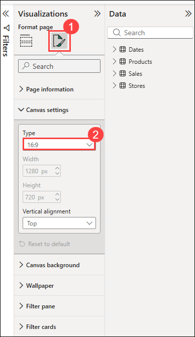


### Bar chart — Sales by store

1. On the **Insert (1)** ribbon, select **Text box (2)**. Draw a text box across the top of the page and type **`Contoso Retail — Store Performance` (3)**. Format it as **Size: 36 (4)**, **bold (5)** and **Center (6)**. This is your report title.

   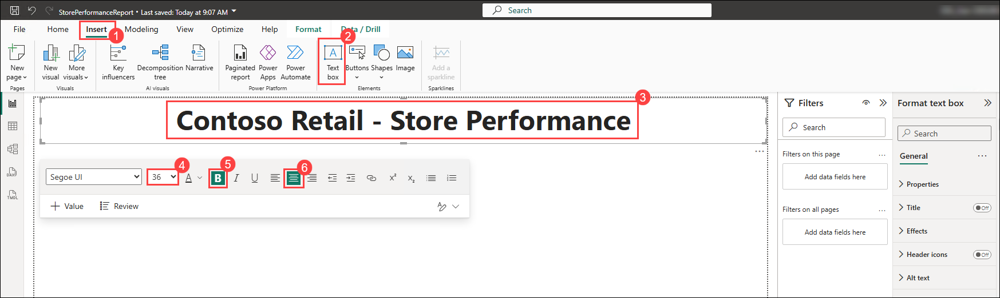

2. Below the title, add the first visual:

   - On the report canvas, click an empty area to deselect the title.
   - In the **Visualizations** pane, select the **Stacked bar chart** icon.

      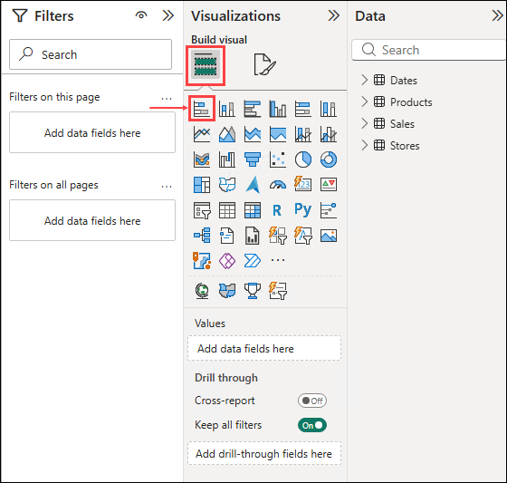

   - From the **Data** pane, expand **Stores (1)** table. drag `StoreName` (2) to the **Y-axis** well.

      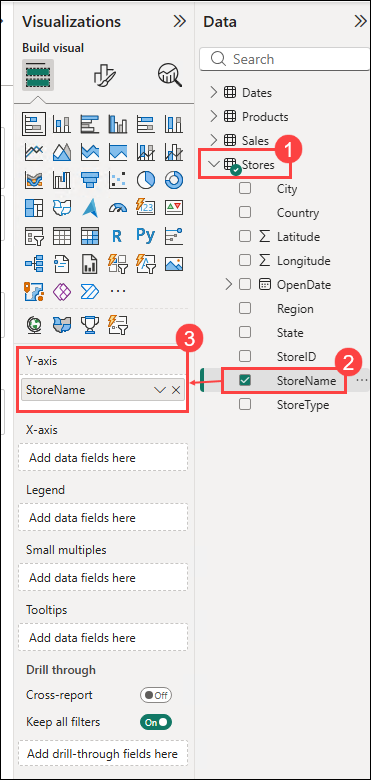

   - Expand **Sales (1)** table. Drag `SalesAmount` (2) to the **X-axis (3)** well.

      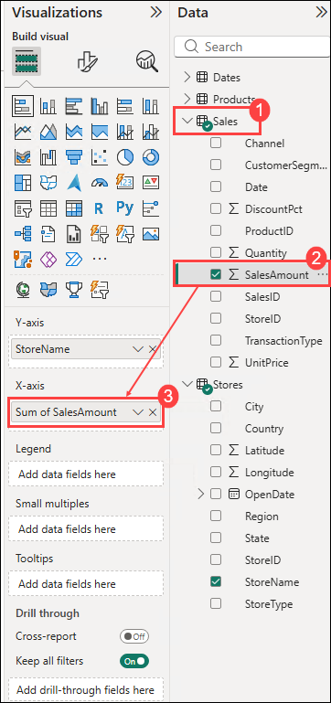

3. Sort the bar chart by sales, descending:

   - Select the **More options (1)** (…) button on the visual.
   - Choose **Sort by (2)** > **Sum of SalesAmount** > **Sort descending (3)**.

      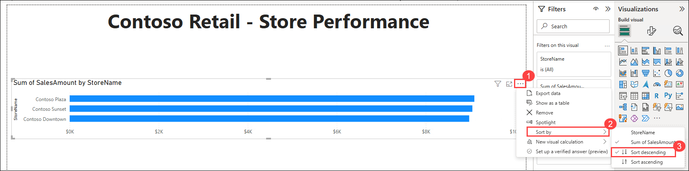

4. Resize the bar chart to occupy the left half of the page below the title.

   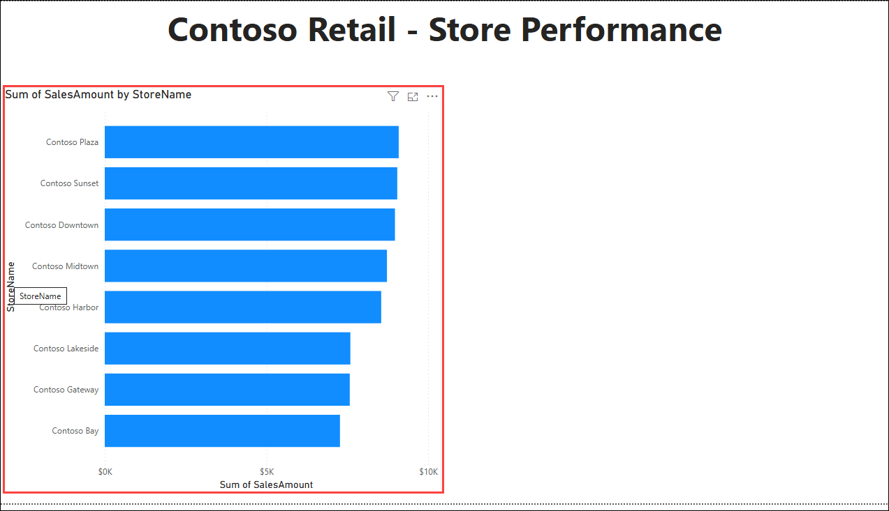


### Line chart — Sales trend over time

1. Deselect the bar chart by clicking empty space, then add a new visual:

   - In the **Visualizations** pane, select **Line chart**.

      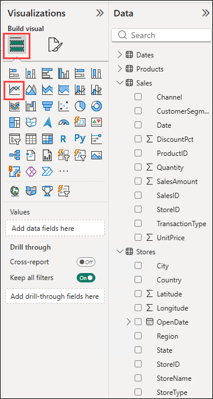

   - Expand Dates table. Drag `Date` to the **X-axis** well. Power BI creates a date hierarchy (Year → Quarter → Month → Day).

      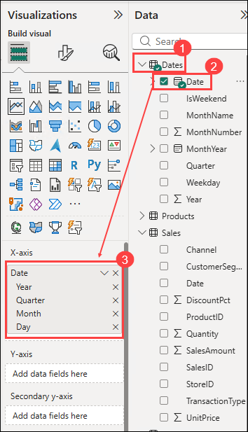

   - Drag `Sales[SalesAmount]` to the **Y-axis** well.

      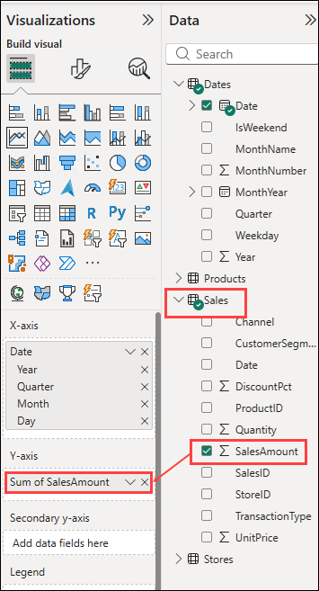

2. Resize the line chart to occupy the right half of the page next to the bar chart.

      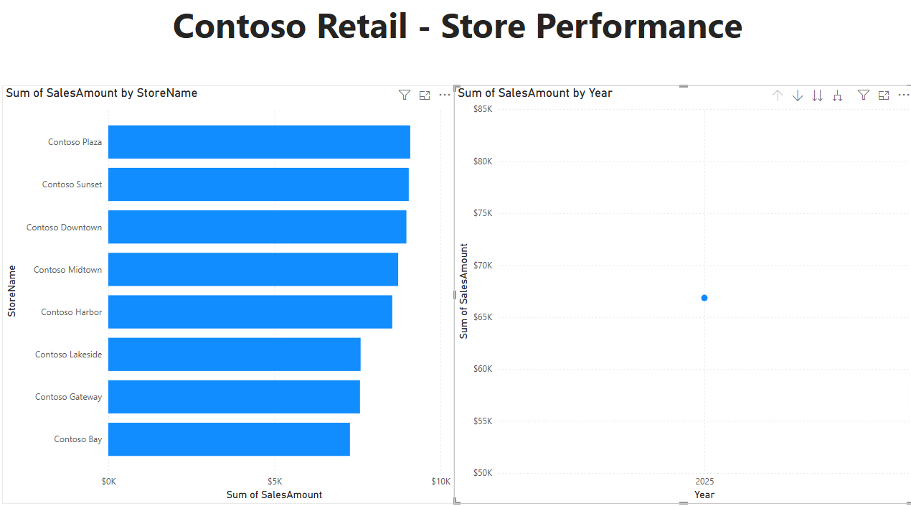

3. If the X-axis shows just `Year`, expand the hierarchy so the line has more points:

   - Select the line chart.
   - In the top-right corner of the visual, select the **Expand all down one level** icon (a downward branching fork). Click it twice to expand to the Month level.

      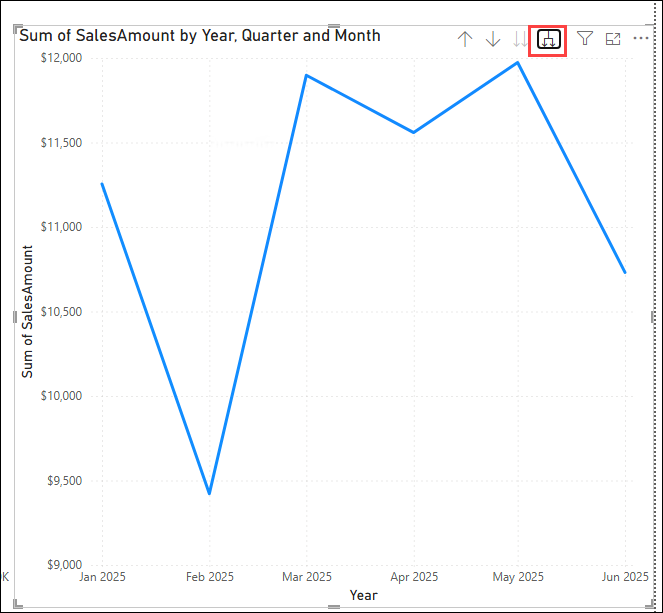


### Table — Store × Category sales

1. Deselect the line chart, then add a new visual:

   - In the **Visualizations** pane, select **Table**.
   - Drag `Stores[StoreName]` to the **Columns** well.
   - Drag `Products[Category]` to the **Columns** well below `StoreName`.
   - Drag `Sales[SalesAmount]` to the **Columns** well below `Category`.

      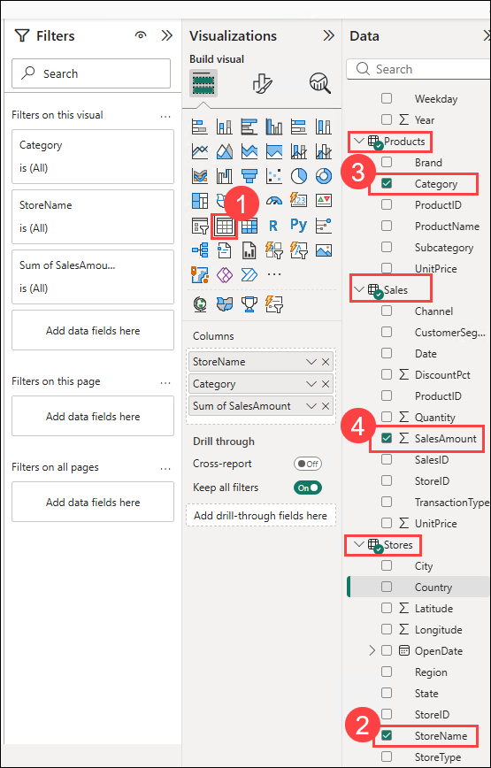


2. Position the table below the bar chart, in the lower-left of the page.

### Map — Sales by store location

1. Deselect the table, then add a new visual:

   - In the **Visualizations** pane, select **Map** (the globe icon). If a prompt about **enabling maps** appears, select **OK**.
   - Drag `Stores[Latitude]` to the **Latitude** well.
   - Drag `Stores[Longitude]` to the **Longitude** well.
   - Drag `Sales[SalesAmount]` to the **Bubble size** well.
   - Drag `Stores[StoreName]` to the **Tooltips** well.

      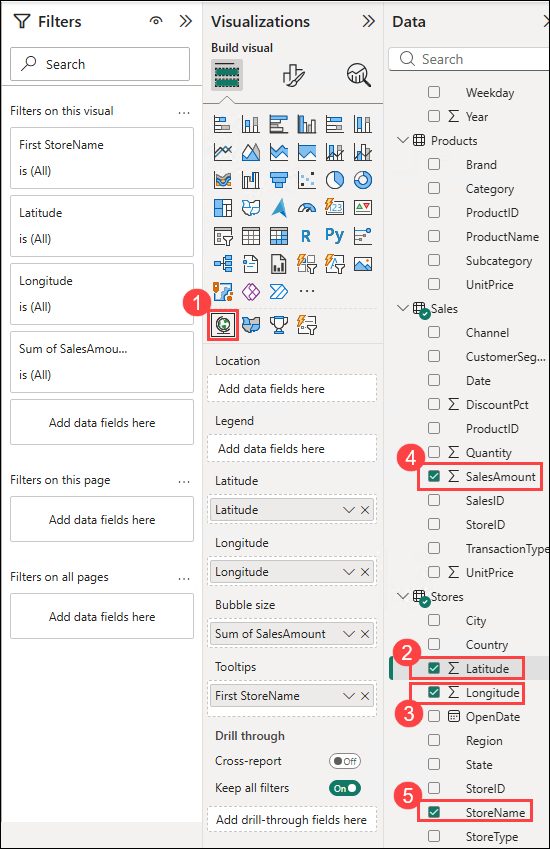

2. Position the map to the right of the table, in the lower-right of the page.

3. Save the report — select **File** > **Save** (or press **Ctrl+S**).

1. If map and filled map visuals as disabled. Select **File**.

      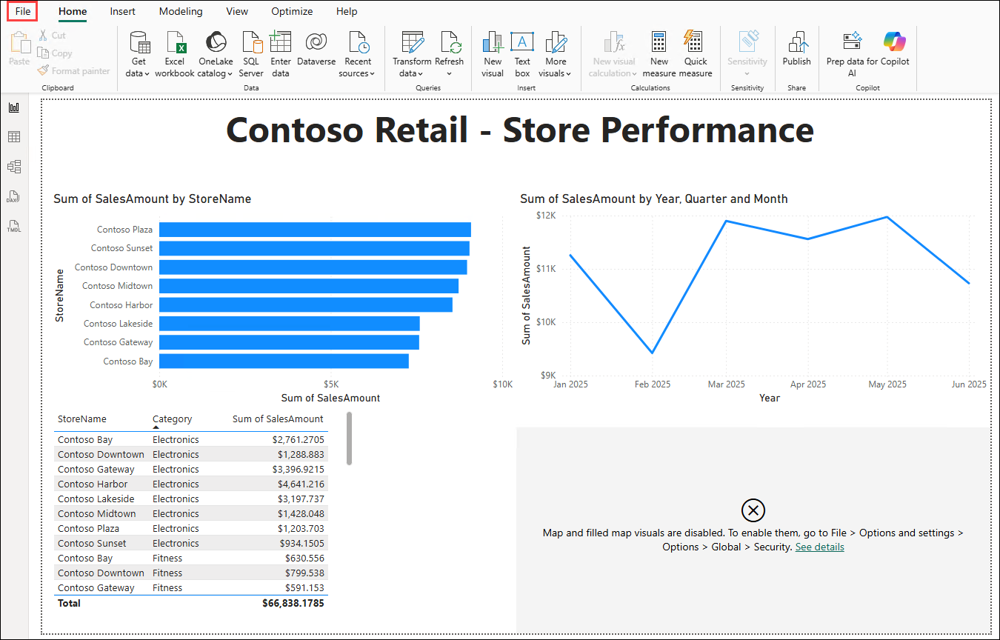

1. Then select Options and settings > Options.

      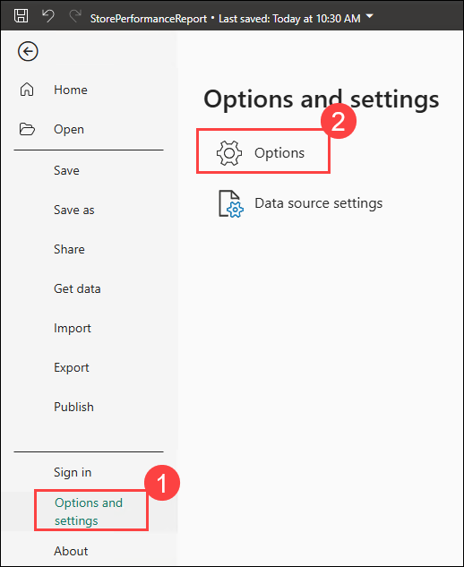

1. Select Security under global. Then check map and filled map visual. Select save.

      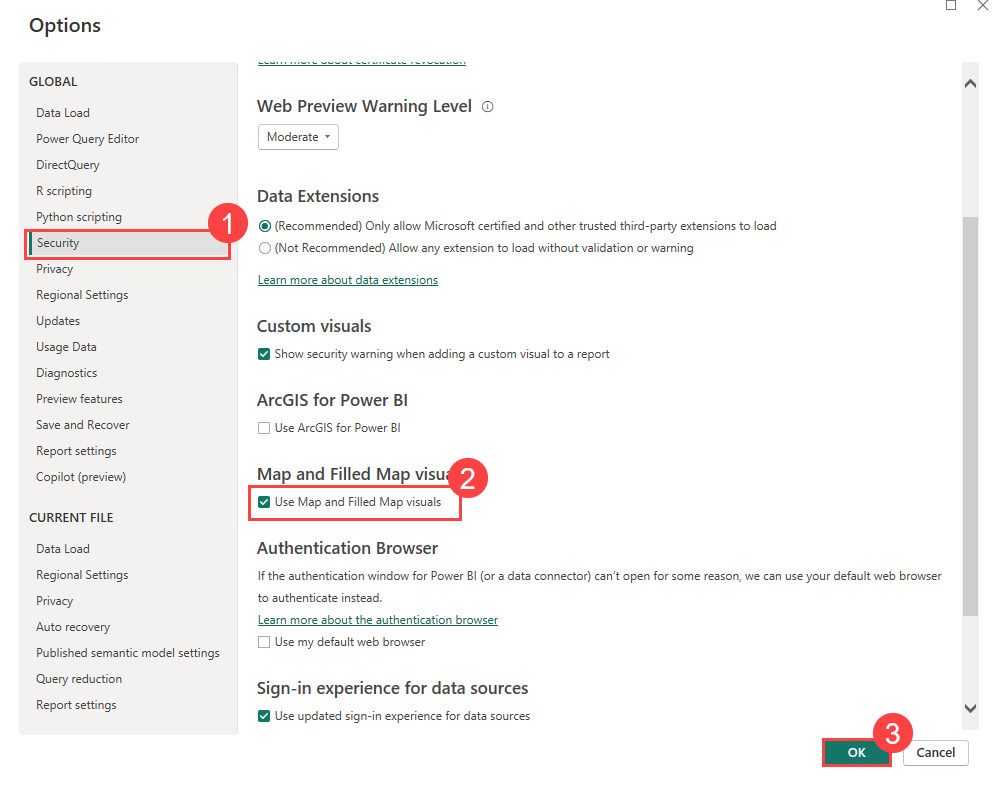

!. Close the Power Bi Report and open again from path C:\LabFiles\StorePerformanceReport.pbix

      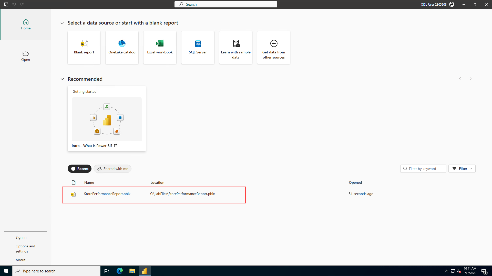

## Task 2: Add KPI cards

In this task, you will add three KPI cards at the top of the page to surface the headline numbers: total sales, total units sold, and the top-performing store.

### Card 1 — Total sales

1. Click empty space on the canvas.

2. In the **Visualizations** pane, select **Card (1)** (the number icon).

3. Drag `Sales[SalesAmount]` (2) into the **Value (3)** well.

      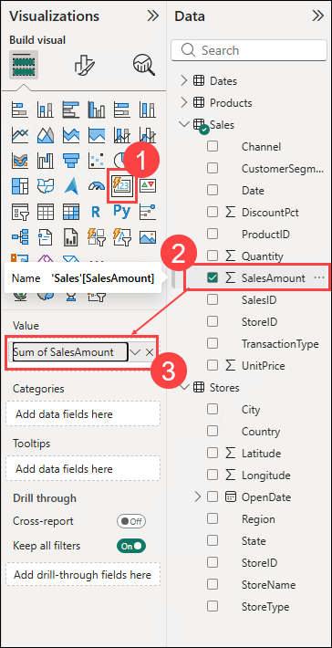

4. By default, Power BI shows a sum. Confirm the card label reads **Sum of SalesAmount**. Rename it for clarity:

   - Right-click the field in the **Value (1)** well and choose **Rename for this visual (2)**.

      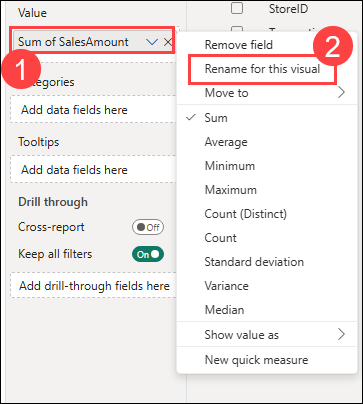

   - Type `Total Sales` and press **Enter**.

      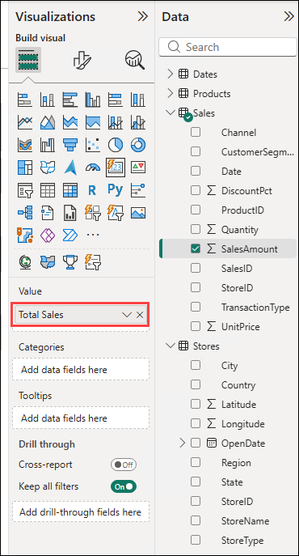

6. Position the card in the top-left, just below the title.

      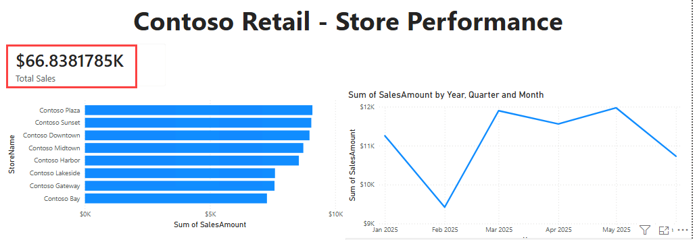


### Card 2 — Total units

1. Click empty space, insert another **Card (1)** visual.

2. Drag `Sales[Quantity]` (2) into the **Value (3)** well.

      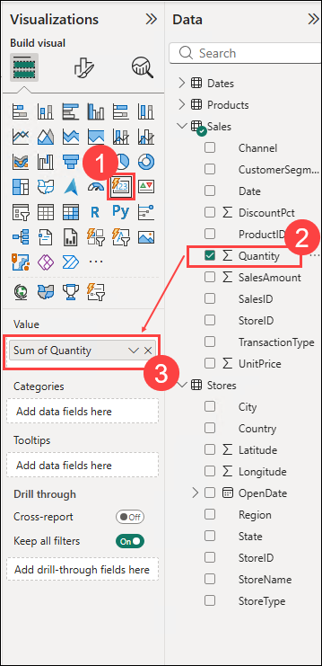

3. Click on **dropdown (1)**. Select **Rename for this visual (2)** and name as `Total Units` (3).

      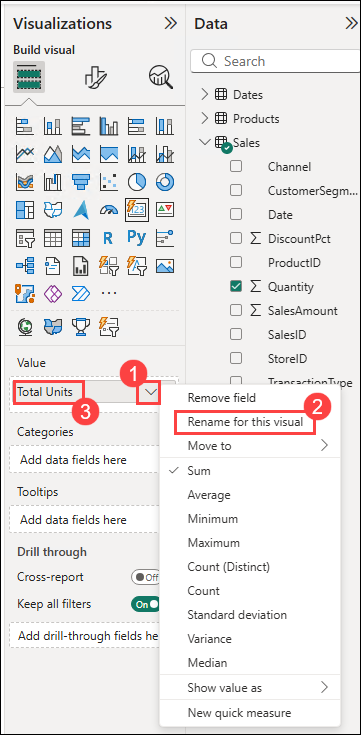

4. Position this card next to the Total Sales card.

      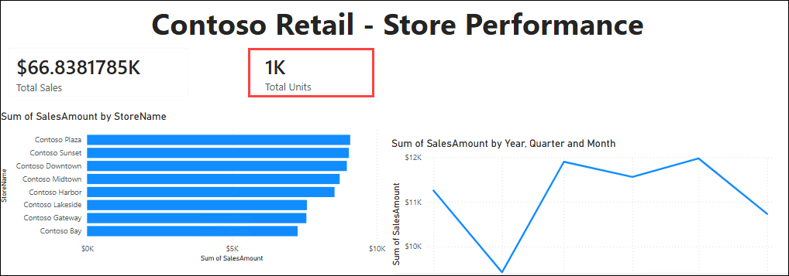

### Card 3 — Top store

The Top Store card needs the store name with the highest total sales. You will use the **TOPN** feature of a card by combining a text card with a value filter.

1. Click empty space, insert another **Card** visual.

2. Drag `Stores[StoreName]` into the **Categories** well.

      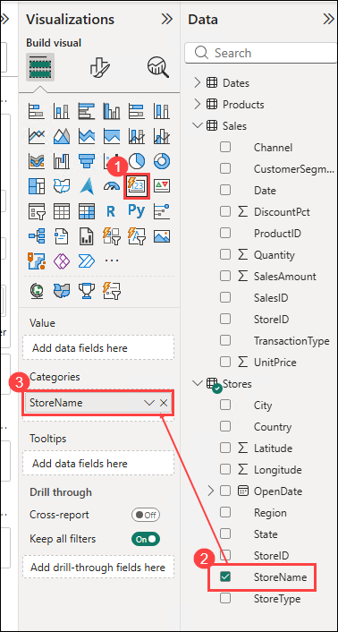

3. In the **Filters** pane on the right, expand the filter for `StoreName` under **Filters on this visual**.

4. Change the **Filter type** to **Top N**.
      - **Show items**: **Top 1**
      - **By value**: select `Sales[SalesAmount]` into the **By value** area.

      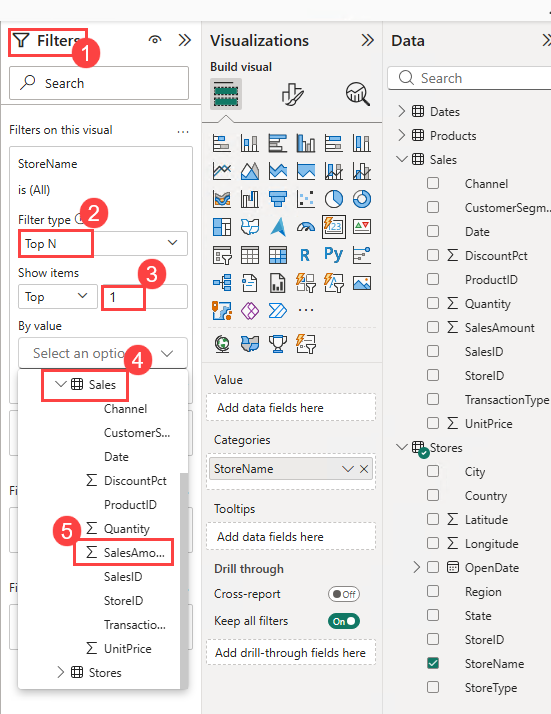

6. Select **Apply filter**. The card now shows the single store name with the highest total sales.

      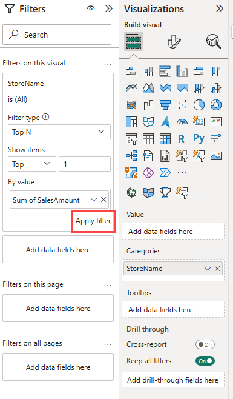

7. Rename the field in the visual to `Top Store`.

      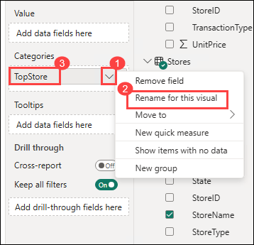

8. Position this card next to the Total Units card. You should now have three KPI cards in a row across the top of the page.

      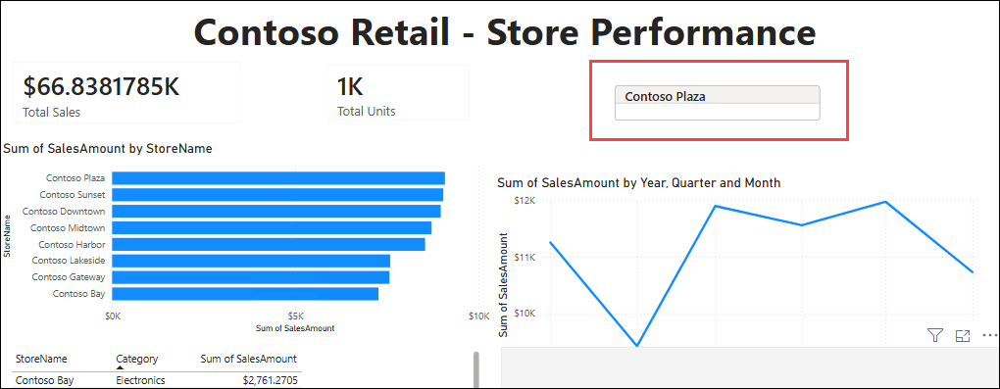

9. Save the report — **Ctrl+S**.

## Task 3: Add slicers and filters

In this task, you will add slicers so users can filter the page by region, category, and date range, and you will add a page-level filter to limit the report to a single year.

### Slicer 1 — Region

1. Click empty space on the canvas.

2. In the **Visualizations** pane, select **List Slicer**.

      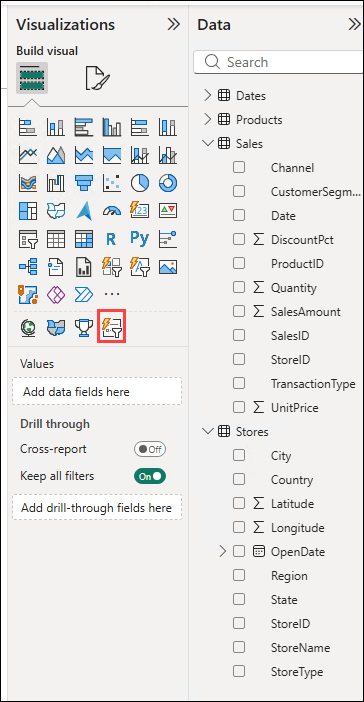

3. Drag `Stores[Region]` into the **Value** well.

      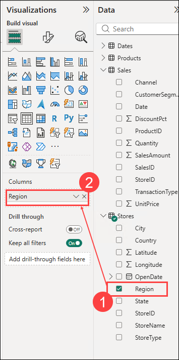

4. This gives a simple list of regions.

5. Resize the slicer to a small strip along the top-right of the page.

      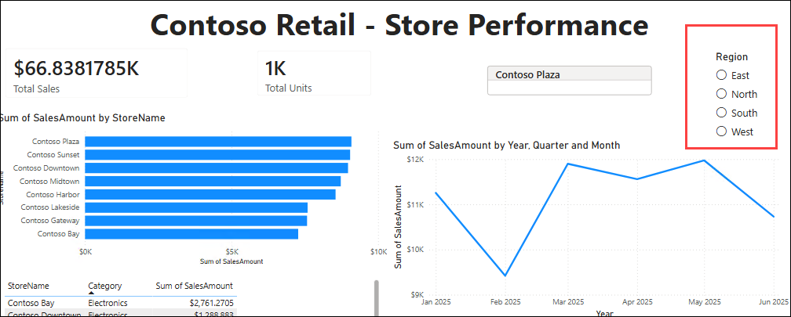


### Slicer 2 — Category

1. Click empty space, insert another **Slicer** visual.

2. Drag `Products[Category]` into the **Field** well.

4. Position the category slicer next to the region slicer.

      

### Slicer 3 — Date range

1. Click empty space, insert another **Slicer** visual.

2. Drag `Dates[Date]` into the **Value** well.

3. Power BI recognizes the date field and defaults to a range slider. Confirm the slicer style is **Between**.

4. Position the date slicer along the top of the page or in a sidebar area.

### Page-level filter

Suppose leadership only cares about 2025 sales.

1. In the **Filters** pane, expand **Filters on this page**.

2. Drag `Dates[Year]` into **Filters on this page**.

3. Set the filter type to **Basic filtering** and select `2025`.

4. Save the report — **Ctrl+S**.

## Task 4: Use drill-down and cross-filtering

In this task, you will enable drill-down on the line chart so users can drill from year to month, and you will confirm that clicking a bar in the bar chart cross-filters the other visuals.

### Drill-down on the line chart

1. Select the line chart.

      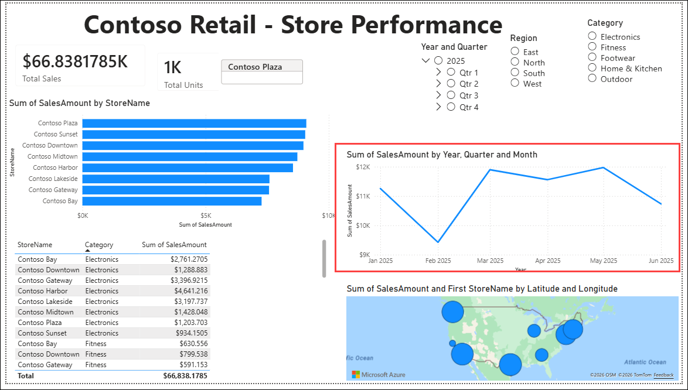

2. At the top-right of the visual, locate the drill-mode icons:

   - **Drill up (1)** (upward arrow)
   - **Drill down (2)** (downward arrow)
   - **Go to next level in the hierarchy (3)** (two downward arrows)
   - **Expand all down one level (4)** (branching arrows)

      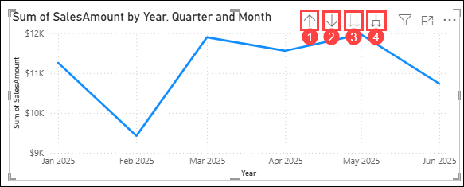


3. Turn on drill mode by selecting the **Drill down** arrow (it becomes highlighted).

      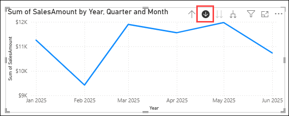

4. Click a data point on the line — for example the point for 2025 or Q2 2025. The chart drills into the next level of the date hierarchy.

      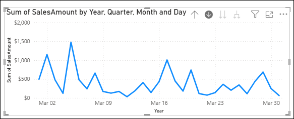

5. To drill back up, select the **Drill up** arrow.

      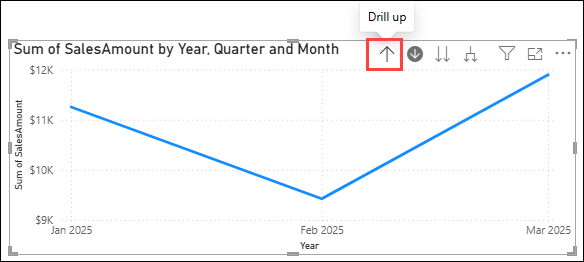

6. Turn off drill mode by selecting the **Drill down** arrow again.

      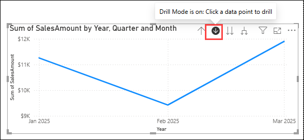


### Cross-filtering between visuals

1. Select the bar chart (Sum of SalesAmount by StoreName).

      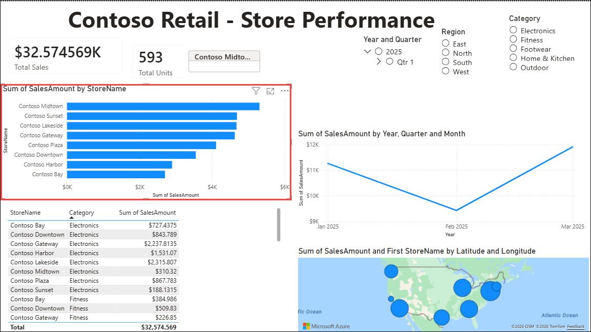

2. Click the bar for one store — for example `Contoso Downtown`.

      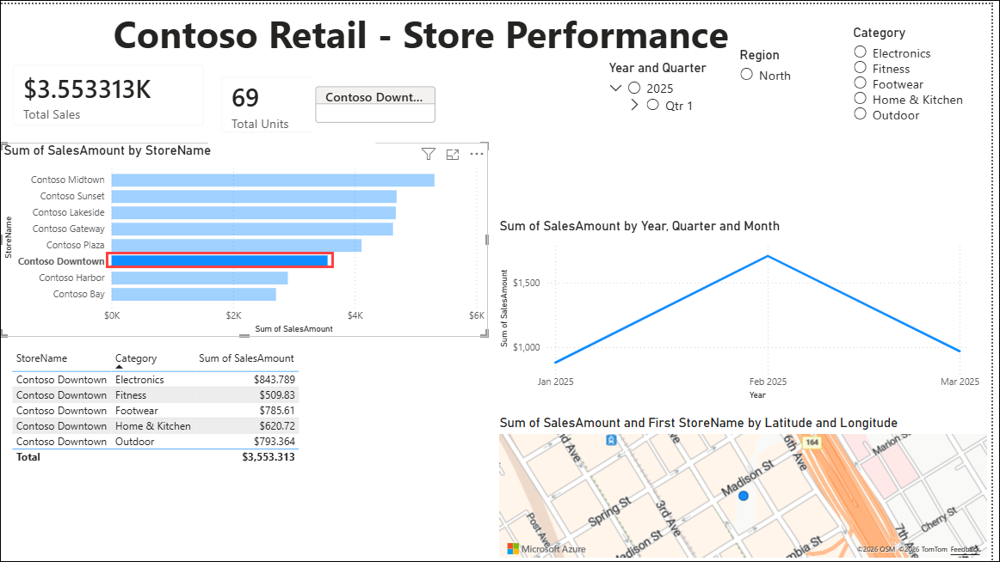

3. Observe the other visuals on the page:

   - The line chart now shows only that store's sales trend.
   - The table filters to that store's rows.
   - The map highlights that store's bubble.
   - The KPI cards recalculate for that store.

      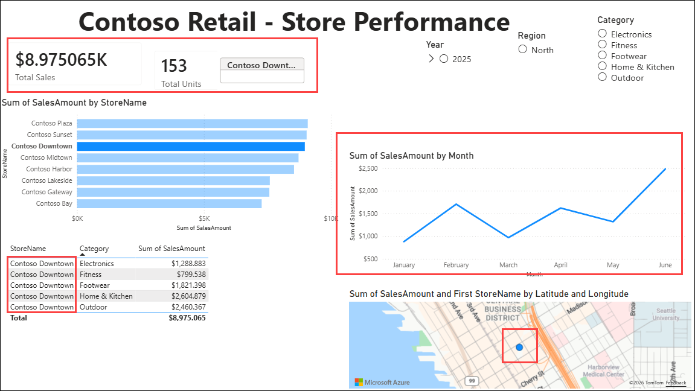

4. Click the same bar again (or select the empty area next to the bars) to clear the filter.

### Configure edit interactions (optional but recommended)

You can control which visuals a source visual cross-filters, cross-highlights, or leaves alone.

1. Select the **bar (1)** chart.

2. On the ribbon, select **Format (2)** > **Edit interactions (3)**.

      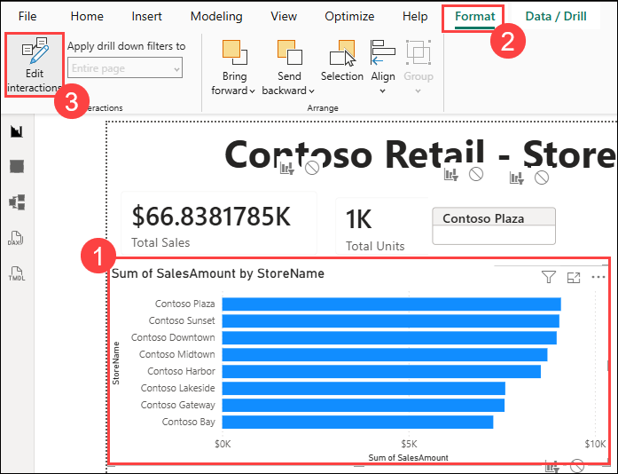

3. Small filter/highlight/none icons appear on top of every other visual on the page.

4. Confirm each other visual is set to **Filter** (the funnel icon) so clicking a bar filters everything.

      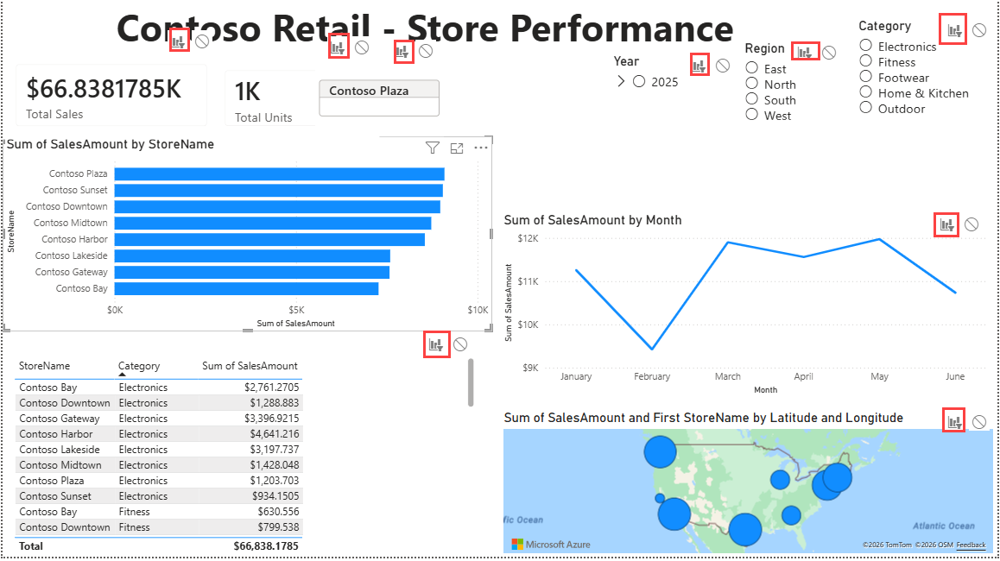

5. Turn off **Edit interactions** by selecting the ribbon button again.

### Polish the page

1. Give each visual a clear title:

   - Select the visual.
   - In the **Visualizations** pane, select **Format your visual**. Navigate to General tab.
   - Expand **Title** and edit the **Text** field. Suggested titles: `Sales by Store`, `Sales Trend`, `Store × Category Sales`, `Store Locations`.

      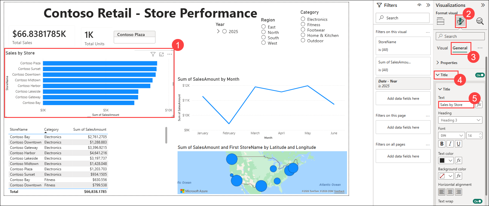

2. Align the visuals so the layout looks like a grid.

   - Hold **Ctrl** and click several visuals.
   - On the ribbon, select **Format** > **Align** > **Align left** (or similar) to snap them.

3. Save the report — **Ctrl+S**.

## Summary

In this exercise you built the Store Performance report page with a bar chart, line chart, card KPIs, a category-by-store table, and a store map. You added a region slicer, a category slicer, and a date range slicer, plus a page-level filter for the year. You enabled drill-down on the line chart and confirmed that clicking one visual cross-filters the others. Your report is now interactive and saved. In Exercise 3 you will add DAX measures and finish preparing the evidence files.