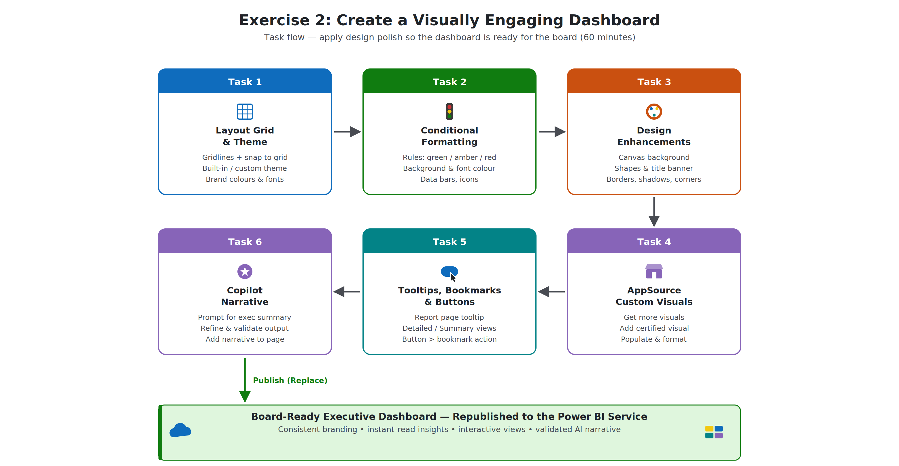
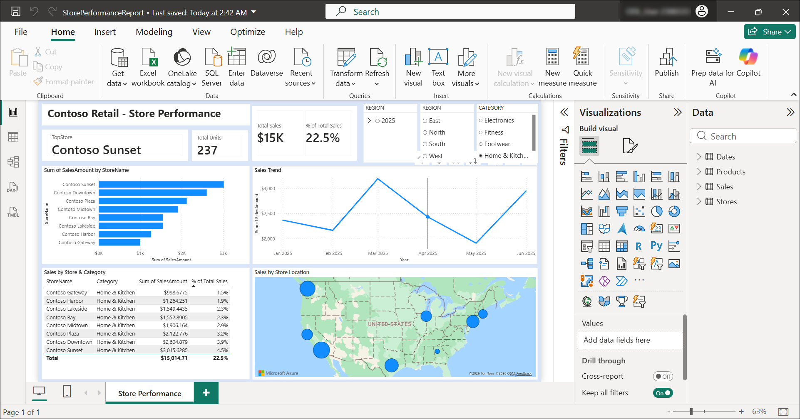
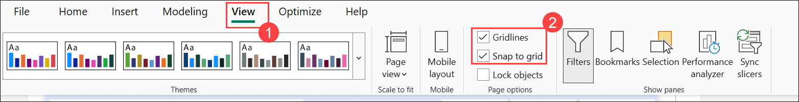
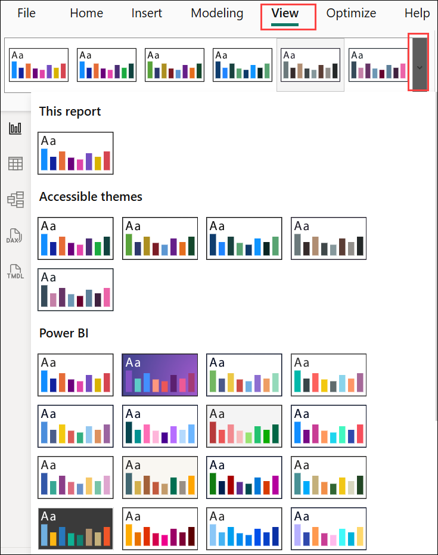
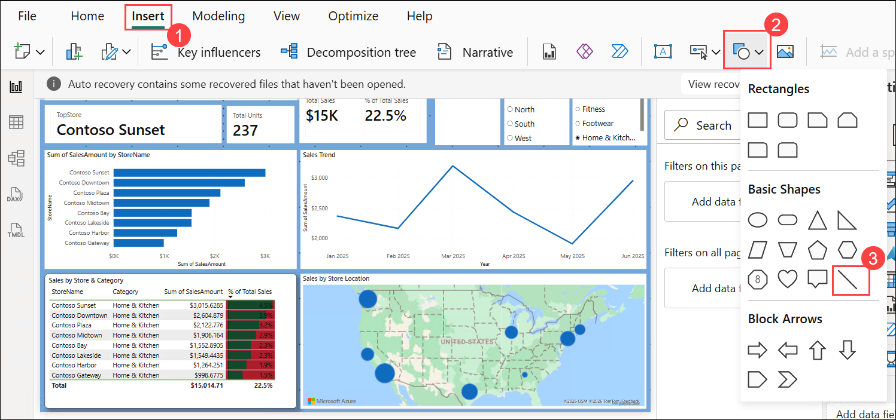
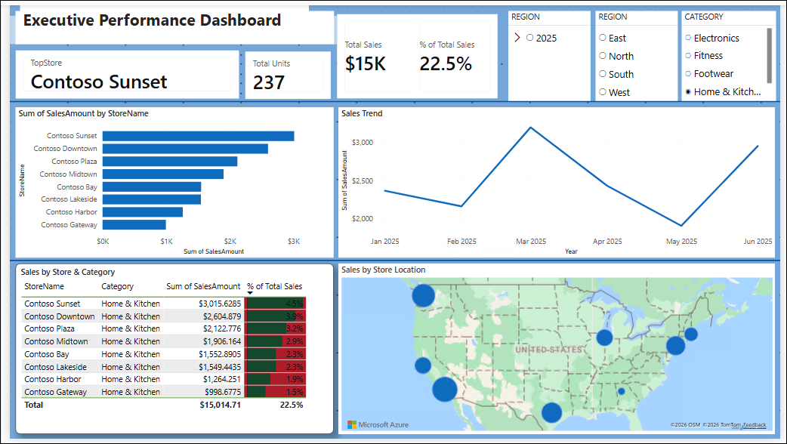

# Exercise 2: Create a Visually Engaging Dashboard

### Estimated Duration: 60 Minutes

## 📘 Scenario

The Contoso Retail report is now live in the Power BI Service — but a report full of correct numbers can still fail its audience if it is hard to read or dull to look at. The executive team has asked for a **board-ready** experience: consistent branding, instantly readable performance indicators, richer visuals, and interactivity that lets one page do the work of several.

In this exercise, you will apply design polish so the dashboard is ready for the board: a layout grid and brand theme, conditional formatting, background and shape design elements, a custom AppSource visual, interactive tooltips, bookmarks and buttons, and finally an AI-generated narrative summary using Copilot.

## 🎯 Objectives

In this exercise, you will complete the following tasks:

- Task 1: Apply a layout grid and a theme (brand colours)
- Task 2: Add conditional formatting
- Task 3: Add background images, shapes, and subtle design enhancements
- Task 4: Add custom and third-party visuals from AppSource
- Task 5: Add tooltips, bookmarks, and buttons for interactivity
- Task 6: Generate a narrative summary with Copilot

## 🧩 Architecture Diagram

   

## Task 1: Apply a layout grid and a theme (brand colours)

In this task, you will align the visuals on the canvas using gridlines and snap-to-grid, and apply a consistent theme. Alignment and coordinated colours are the fastest way to make a report look professionally designed rather than assembled.

1. Return to **Power BI Desktop** and open the **StorePerformanceReport** if it is not already open.

   

1. Navigate to the report page that will be enhanced for executive presentation.

   

1. On the **View (1)** ribbon, select the checkboxes for **Gridlines** and **Snap to grid (2)**.

   

   > **Note**: If prompted that snapping applies to objects as you move them, click **OK** to continue.

1. Reposition and resize the visuals so their edges align consistently with the grid on the report canvas.

1. Standardize the spacing between visuals — aim for even gaps on all sides so the page reads as an intentional layout.
   > **Tip**: You can select multiple visuals with **Ctrl+Click** and use **Format (1) > Align (2)** to align or distribute them precisely.

   

1. On the **View** ribbon, expand the **Themes** gallery.

   

1. Select an appropriate built-in theme that suits an executive audience — subtle colours with good contrast, such as **Executive** or **Accessible City Park**.

   

1. To match Contoso's brand style, expand the **Themes (1)** gallery again and select **Customize current theme (2)**.

   

1. In the **Customize theme** dialog, update the following:

   - **Name and colors (1)**: Adjust the first two theme colours to the brand palette (for example, `#0F6CBD` and `#212121`)
   
     

   - **Text (2)**: Set a consistent font family and sizes for titles, cards, and tab headers
   - Click **Apply (3)**.

     

1. Review the report page — all visuals should now reflect the applied theme automatically.

   

1. Save the report by selecting **File > Save**.

   

   

## Task 2: Add conditional formatting

In this task, you will apply conditional formatting so important patterns and exceptions jump out immediately — green means performing, red means look here. This turns a wall of numbers into an instantly readable story.

1. On the report page, select the **table visual** titled "Sales by Store & Category" (columns: StoreName, Category, Sum of SalesAmount, % of Total Sales).

   - Click once anywhere inside the table.
   - Small square handles will appear around its edges, confirming it is selected.

     

1. With the visual selected, in the **Visualizations** pane, locate the numeric field to be formatted — in this case, **% of Total Sales**.

   - Below the chart icons in the Visualizations pane, you will see the list of fields for this table: StoreName, Category, Sum of SalesAmount, % of Total Sales.
   - Find **% of Total Sales** in that list.

      

1. Right-click the field (or open its dropdown menu) and select **Conditional formatting (1)**, then choose **Background color (2)**.

   - Hover over **% of Total Sales** until a small downward arrow (▼) appears next to it.
   - Click the arrow to open the dropdown menu.
   - Hover over **Conditional formatting (1)** — a side menu will appear.
   - Click **Background color (2)**.

     

   > **Note**: For chart visuals, conditional formatting is applied from **Format visual > Columns/Bars > Colors > fx** instead.

1. In the **Background color** dialog, configure the following:

   - **Format style (1)**: Rules
   - **What field should we base this on? (2)**: % of Total Sales (should be pre-filled; select from dropdown if not)
   - Add rules with business-friendly logic**:
     - If value is **≥ 4** → **Green** **(3)**
     - click on **+ New rule (4)**
     - If value is **between 2 and 4** → **Amber (5)** 
     - If value is **< 2** → **Red (6)**
   - Click **OK (7)**

     

1. Review the updated visual and confirm the formatting highlights high, medium, and low performers as intended.

   - The % of Total Sales column should now display colored cells: green, amber, or red based on performance.

     

1. Repeat the process on a second element using a different formatting type — add **Data bars** to the **Sum of SalesAmount** column:

   - Hover over **Sum of SalesAmount** in the field list.
   - Click the ▼ arrow → **Conditional formatting (1)** → **Data bars (2)**.
   - Default settings are sufficient — click **OK (3)**.

     

     

1. Review and Save the report.

   - final report looks like this after applying all conditional formating

     

   - Press **Ctrl + S**, or go to **File (1) > Save (2)**.
   
      

      

## Task 3: Add background images, shapes, and subtle design enhancements

In this task, you will add presentation elements — a background, section shapes, and a title banner — that improve structure and professional appearance without reducing usability. The goal is polish, not clutter: design should support the data, never compete with it.

1. Click an empty area of the report page you are polishing so no visual is selected.

   

1. In the **Visualizations** pane, select **Format page (paintbrush icon)** and expand **Canvas background**.

   

1. Configure the canvas background:

   - **Color**: A very light neutral tint from your theme
   - **Transparency**: Adjust (for example, **15%**) so all visuals remain fully readable

      

1. On the **Insert (1)** ribbon, select **Shapes (2)** and choose **Rectangle (3)**.

   

1. Resize and position the rectangle across the top of the page to act as a **title banner**, and format it:

   - **Style > Fill**: A primary brand colour
   - **Border**: Off, or a subtle darker shade

      

   - Send it behind other elements if needed by selecting the rectangle and using **Format (1) > Send backward (2)**

     

1. Add one or two thin **Line** shapes to visually separate sections of the page (for example, KPIs at the top from detail charts below).

   - Go to **Insert (1)> Shapes (2) > Line (3)**.

      

   - Click and drag to draw a thin horizontal line between your KPI cards row and the charts below.

      

1. On the **Insert** ribbon, select **Text box** and enter the following page title:

   ```
   Executive Performance Dashboard
   ```
   

1. Format the title so it matches the selected report theme — set the font, size (for example, **24pt**), colour (white or a brand colour that contrasts with the banner), and **bold**, then position it on the title banner.

   

1. Select one of your main visuals and, in **Format visual > General > Effects**, review the subtle effect options:

   - **Background** — a soft white/neutral card behind the visual
   - **Visual border** — with **Rounded corners** (for example, `8 px`)
   - **Shadow** — a light outer shadow for gentle depth

      

1. Apply consistent effects across the visuals on the page, then step back and confirm the overall design remains clean, professional, and easy to read.

1. Review and Save the report.

   - final report looks like this after applying all.

     

   - Press **Ctrl + S**, or go to **File (1) > Save (2)**.
   
      

      

## Task 4: Add a Bullet Chart from AppSource
 
Contoso needs to see at a glance which cities beat, met, or missed the sales target. A **Bullet Chart** packs actual value, target, and colour-coded performance bands into one compact row per city — better than a plain bar chart for KPI dashboards.
 
1. In the **Visualizations** pane, click the **ellipsis (…)** and select **Get more visuals**.

   

2. On the **AppSource** tab, search for `Bullet Chart`, select the **certified** result, and click **Add**. Click **OK** on the import confirmation.

   

   

3. Click the new **Bullet Chart** icon in the **Visualizations** pane to add it to the report canvas. Position and resize it under the KPI card row.

   

   

4. From the **Data** pane, populate the field wells:
   - **Category**: `Stores[City]`
   - **Value**: `Sales[Total Sales]`

   

5. In **Format visual**, set the range, target, and colours so all eight Contoso cities read on a consistent scale (their Total Sales are between about $7,300 and $9,100):
   - **Values > Target**: `8000` — Contoso's H1 city benchmark
   - **Values > Minimum**: `0`
   - **Values > Needs Improvement**: `7000` (below this = poor band)
   - **Values > Satisfactory**: `9000` (below = on-target, above = good)
   - **Values > Maximum**: `10000`

   

6. Save the report. Each Contoso city now shows a compact bar-plus-target-plus-bands indicator that reads at a glance.

## Task 5: Add tooltips, bookmarks, and buttons for interactivity
 
In this task, you will make the dashboard interactive in three ways: a **report-page tooltip** that shows deep store detail on hover, **bookmarks** that capture two named view states (Executive Summary and Analyst Detail), and a **button** that switches between them.
 
### Part A: Build the tooltip page
 
1. At the bottom of the report canvas, click the **+ (New page)** icon. 
 
   

1. Right click on the page and rename the new page:
   ```
   Store Detail Tooltip
   ```

   

2. With no visual selected, open **Format page** and configure:
   - **Page information > Allow use as tooltip**: **On**

      

   - **Canvas settings > Type**: **Tooltip** (this locks the canvas to 320 × 240 px)

      

3. Add two compact visuals to the tooltip canvas — a KPI card across the top and a clustered bar chart underneath. Build each in turn:

   **Card — Total Sales**
   1. Click an empty area of the tooltip canvas.

   2. In the **Visualizations** pane, select the **Card** icon.

      

   3. From the **Data** pane, drag `Sales[Total Sales]` into the **Fields** well.

      

   4. Resize the card to about `320 × 70 px` and position it across the top of the canvas.

      


   **Category mini-bar — Top categories**
   1. Click an empty area of the canvas.
   2. In the **Visualizations** pane, select the **Clustered bar chart** icon.

      

   3. Drag `Products[Category]` into the **Y-axis** well.

      

   4. Drag `Sales[Total Sales]` into the **X-axis** well.

      

   5. Resize the chart to fill the bottom of the canvas — roughly `320 × 170 px`.
   6. In **Format visual**, apply the compact settings so the bar chart fits the tooltip canvas cleanly. **General > Title > Text**: `Top categories`, **Font size** `10`

      

### Part B: Wire the tooltip to the Sales by Store visual
 
4. Return to the main **Store Performance** page and select the Sales by Store bar chart.

   

5. Navigate to **Format visual (1) > General (2) > Tooltips (3)**, 
   
   

1. Set:
   - **Type**: **Report page (1)**
   - **Page**: **Store Detail Tooltip (2)**

   

6. Hover over any bar in the chart. The tooltip page appears, filtered automatically to that store — the two cards recalculate and the mini-bar shows that store's category mix.

   

### Part C: Capture two bookmarks
 
7. On the **View (1)** ribbon, enable the **Bookmarks** and **Selection** panes.

   

8. Arrange the page in its **full analyst view** — every visual visible, no slicers filtered. In the **Bookmarks** pane click **Add (1)**, then use the **⋯** menu to **Rename** to `Analyst Detail` (2). 
 
   
 
9. Now build the executive-summary state:
   - In the **Selection** pane, click the **eye icon** next to the store × category **table** to hide them.

      

   - In the **Bookmarks** pane click **Add**, then **Rename** to `Executive Summary`.

      

   > **Note:** You now have two bookmarks: `Analyst Detail` (everything visible) and `Executive Summary` (only KPIs, cards, main chart, and map).
   
### Part D: Add a toggle button
 
10. On the **Insert (1)** ribbon, select **Buttons (2) > Blank (3)**. Position the button in the top-right of the page near the report title.

      

11. In **Format button (1)**:
    - **Style(2) > Text (3)**: Toggle on (4)
    - Text: `Executive Summary` (5)

      

    - **Action (1)**: **On (2)**

      

    - **Action > Type**: **Bookmark (1)**
    - **Action > Bookmark**: **Executive Summary (2)**

      

12. Hold **Ctrl** and click the button. The page collapses to the executive state. Add a second button labelled `Back to Detail` wired to the `Analyst Detail` bookmark so users can return.

      

13. Save the report.
 
## Task 6: Generate a narrative summary with Copilot
 
Contoso's executives want a plain-language summary alongside the visuals. Power BI's **Narrative** visual, powered by Copilot, reads the visuals on the page and generates a written summary with footnoted references to the source visuals.
 
1. On the report ribbon, click on Home tab and click **Copilot** to open the Copilot pane.

   

1. In connect to workspace, Select **PowerBi (1)** workspace. Then **Select Workspace (2)**.
      

1. click an empty area of the canvas. In the **Visualizations** pane, select the **narrative** icon. Power BI reads the visuals on the page and auto-generates a paragraph of contextual insights.
   

2. Use one of the quick-prompt buttons — **Give an executive summary**, **Answer likely questions from leadership**, or **Create a bulleted list of insights** — or type a custom prompt in the text box, for example:
   ```
   Summarize the data.
   ```

   

3. Confirm **Reference visuals** is set to **Current page**, then click **Update**. Copilot writes a narrative such as *"Overall total sales are $66,838 across 1,200 units, with Contoso Plaza identified as the top store…"*. Each sentence is footnoted with the visual it draws from.
   
4. Resize and position the narrative visual under the KPI card row. Cross-check every figure against the source visuals — KPI cards, Sales by Store bar chart, and Sales Trend line chart — and edit any wording that misrepresents the data. Save the report.

   

 
##  Summary
 
In this exercise, you have accomplished the following:
 
- Applied a layout grid and a consistent brand theme
- Added rule-based conditional formatting to highlight performance
- Enhanced the page with a background, shapes, a title banner, and subtle effects
- Imported and configured a custom visual from AppSource
- Built a report page tooltip, bookmarks, and a bookmark-triggered button
- Generated and validated a Copilot narrative summary, and republished the enhanced report
### You have successfully completed the lab. Click on **Next >>**.
 
